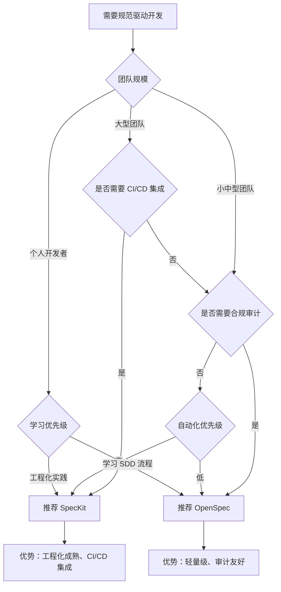

# AI Coding 内部分享大纲

## 目录
- [背景与动机](#背景与动机)
- [主流工具介绍](#主流工具介绍)
- [开发范式变化](#开发范式变化)
- [最佳实践](#最佳实践)
- [实战案例](#实战案例)
- [常见误区与风险](#常见误区与风险)
- [行动建议](#行动建议)

---

## 背景与动机

### 为什么现在需要了解 AI Coding？
- 技术发展趋势：从辅助到核心
- 行业现状：头部团队已经普及
- 个人收益：效率提升、技能升级
- 公司收益：降本增效、知识沉淀

### AI Coding 能带来什么？
- 编码效率提升 2-5x
- 降低认知负担，聚焦业务逻辑
- 加速新人上手和知识传递
- 减少重复性编码工作

---

## 主流工具介绍

### 1. 编辑补全助手

#### GitHub Copilot
- **定位**：GitHub 官方代码补全助手
- **优势**：
  - 与 GitHub 生态深度集成
  - 支持 100+ 种编程语言
  - 上下文感知能力强
  - 实时代码建议
- **适用场景**：日常编码、函数补全、代码片段生成
- **局限性**：无自主性、需要明确引导、无多文件理解
- **定价**：$10/月（个人）、$19/月（企业）

#### GitHub Copilot X
- **定位**：Copilot 的升级版（GPT-4 驱动）
- **优势**：
  - 更强大的上下文理解
  - 支持对话式交互
  - 集成代码解释和文档生成
- **适用场景**：复杂代码生成、代码解释、文档撰写
- **局限性**：成本更高、仍需明确引导
- **定价**：$20/月

#### Tabnine
- **定位**：多模型支持的代码补全助手
- **优势**：
  - 支持私有化部署
  - 可选本地模型（隐私友好）
  - 支持多种 AI 模型（GPT-4, Claude, 自研）
- **适用场景**：需要隐私保护的企业、敏感项目开发
- **局限性**：上下文窗口较小、代码质量参差
- **定价**：$12/月（个人）、企业定制

#### Codeium（补全模式）
- **定位**：免费且无限制的代码补全助手
- **优势**：
  - **完全免费**，无生成额度限制
  - 支持 70+ 种编程语言
  - 轻量级，不拖慢编辑器
  - 支持主流 IDE（VSCode, JetBrains, Vim 等）
- **适用场景**：预算敏感的开发者、日常编码补全
- **局限性**：上下文理解较浅、无自主任务执行
- **定价**：**免费**（个人和商业使用）

#### Amazon CodeWhisperer
- **定位**：AWS 生态的代码补全助手
- **优势**：
  - 深度集成 AWS 服务
  - 支持 AWS 特定代码模式
  - 免费版可用
- **适用场景**：AWS 项目开发、云服务集成
- **局限性**：仅适合 AWS 生态、通用性较弱
- **定价**：免费（个人）、专业版 $19/月

---

### 2. 原生 IDE (AI Native IDE)

#### Cursor
- **定位**：基于 VS Code 的 AI 原生 IDE
- **优势**：
  - **多文件编辑**：同时修改多个文件，保持代码一致性
  - **自主代码库理解**：快速理解整个项目结构
  - **Composer 模式**：长任务规划、分步执行
  - **Tab 切换模式**：Build（编码）、Plan（规划）
  - **内置 Copilot 集成**：兼具补全和自主执行
- **适用场景**：新功能开发、大规模重构、多文件修改
- **局限性**：学习成本、迁移成本、$20/月
- **定价**：$20/月（Pro）、$40/月（Business）

> **Cursor vs 传统 IDE 的核心差异**：
> - 传统 IDE："我敲代码，IDE 帮我补全"
> - Cursor："我描述意图，Cursor 自主编程"

#### Windsurf（Codeium IDE）
- **定位**：Codeium 推出的 AI 原生 IDE
- **优势**：
  - **更便宜**：$15/月（比 Cursor 便宜 $5）
  - **更好的企业合规**：符合 GDPR、SOC2 等安全标准
  - **深度代码库理解**：能理解项目架构和内部约定
  - **免费集成**：内置 Codeium 补全（无额外费用）
- **适用场景**：企业用户、受监管行业（金融、医疗）、需要高安全性
- **局限性**：学习曲线、生态相对 Cursor 较新
- **定价**：$15/月

> **Windsurf vs Cursor 对比**：
> | 维度 | Cursor | Windsurf |
> |------|--------|----------|
> | 定价 | $20/月 | $15/月 |
> | 速度 | 快，但表层 | 慢，但更深入 |
> | 合规性 | 基础 | **高（GDPR/SOC2）** |
> | 适用场景 | 个人/小团队 | **企业/合规** |

#### Replit
- **定位**：云端 AI 原生 IDE
- **优势**：
  - **零配置启动**：浏览器即开即用
  - **内置 AI 助手**：代码生成、调试、部署一体化
  - **实时协作**：多人同时编辑
  - **一键部署**：直接部署到云端
- **适用场景**：快速原型开发、教学、前端项目
- **局限性**：不适合大型项目、网络依赖、隐私问题
- **定价**：$20/月（Core）

---

### 3. IDE 插件

#### Cline (原 Claude Dev)
- **定位**：VS Code 的自主智能助手
- **优势**：
  - **自主任务执行**：可以读取、编辑、创建文件
  - **终端集成**：可以运行命令、安装依赖、运行测试
  - **多文件理解**：理解整个代码库结构
  - **Claude 3.5 驱动**：强大的上下文理解
- **适用场景**：功能实现、Bug 修复、依赖管理、配置调整
- **局限性**：需要监控、防止过度依赖、可能产生不符合预期的代码
- **定价**：$20/月（基于 Claude API）

> **Cline 的独特价值**：
> - 不是简单的补全，而是"虚拟结对编程伙伴"
> - 可以自主执行完整工作流：读代码 → 理解逻辑 → 修改文件 → 运行测试 → 验证

#### Continue
- **定位**：轻量级 VS Code 插件
- **优势**：
  - **灵活配置**：支持多种模型（OpenAI, Claude, 本地模型）
  - **多模型切换**：按需切换不同 AI 模型
  - **成本低**：支持开源模型，可完全免费使用
  - **轻量级**：不占用太多资源
- **适用场景**：轻量级辅助、模型实验、成本敏感项目
- **局限性**：上下文窗口较小、无自主文件编辑
- **定价**：免费（开源）、自付 API 费用

#### Codeium（IDE 插件）
- **定位**：免费且功能丰富的 IDE 插件
- **优势**：
  - **完全免费**：无生成额度限制
  - **支持 70+ 种编程语言**
  - **跨 IDE 支持**：VSCode, JetBrains, Vim, Neovim, Emacs
  - **功能全面**：代码补全、聊天、代码解释、搜索
- **适用场景**：预算敏感的开发者、需要免费替代 Copilot
- **局限性**：上下文理解较浅、无自主任务执行
- **定价**：**免费**（个人和商业使用）

#### JetBrains AI Assistant
- **定位**：JetBrains 官方 AI 插件
- **优势**：
  - **深度集成**：与 IntelliJ IDEA, PyCharm 等无缝集成
  - **上下文感知**：理解项目结构、重构历史
  - **代码重构**：智能重构建议
- **适用场景**：JetBrains IDE 用户、Java/Kotlin/Python 项目
- **局限性**：仅限 JetBrains IDE、$25/月
- **定价**：$25/月

#### Bito
- **定位**：多 IDE 智能助手
- **优势**：
  - **多 IDE 支持**：VSCode, JetBrains, Chrome, Jira
  - **GPT-4 驱动**：强大的上下文理解
  - **代码解释**：易于理解的解释
  - **团队协作**：可共享对话
- **适用场景**：代码审查、学习、团队协作
- **局限性**：上下文窗口限制、无自主编辑
- **定价**：$15/月

---

### 4. CLI 工具

#### aider
- **定位**：代码库级 AI 助手（命令行）
- **优势**：
  - **Git 集成**：自动创建分支、提交、diff
  - **精确控制**：可指定修改哪些文件、哪些行
  - **自动化测试**：修改代码后自动运行测试
  - **支持多种模型**：Claude, GPT-4, 本地模型
- **适用场景**：大型重构、Bug 修复、测试生成、批量修改
- **局限性**：无图形界面、需要命令行熟练度
- **定价**：$10/月（开源版免费）

> **aider 的独特价值**：
> - "AI 驱动的 git workflow"
> - 每次修改都会创建 git diff，方便审查
> - 支持回滚和对比

#### gpt-engineer
- **定位**：AI 驱动的项目生成工具
- **优势**：
  - **项目级生成**：可以生成整个项目结构
  - **可迭代**：基于反馈持续优化
  - **本地运行**：可使用本地模型
- **适用场景**：快速原型、学习项目、启动新项目
- **局限性**：生成质量参差、需要大量调整
- **定价**：开源免费

#### Claude Code（CLI 版本）
- **定位**：Anthropic 官方 AI 编程助手（命令行 + GUI）
- **优势**：
  - **官方集成**：由 Anthropic 官方维护，与 Claude 模型深度集成
  - **双模式支持**：Plan 模式（问答设计）+ Agent 模式（自主执行）
  - **强大的上下文理解**：可以理解整个代码库
  - **Subagent 系统**：支持自定义专业 subagents（code-reviewer, security-auditor 等）
  - **多模型支持**：Claude 3.5 Sonnet, Opus, Haiku 等
- **适用场景**：复杂功能开发、代码审查、需求分析、架构设计
- **局限性**：仅支持 Claude 模型（无法使用 GPT-4、Gemini 等）、需要 API Key
- **定价**：按 Token 计费（Claude API）

> **Claude Code 的独特价值**：
> - "Plan → Execute" 的工作流
> - Plan 模式：Ask（问答）、Quest（规范驱动设计）
> - Agent 模式：自主执行，可以修改文件、运行命令、运行测试
> - 内置 22 个生命周期钩子，精细控制 Agent 行为

#### OpenCode（Oh My OpenCode）
- **定位**：企业级 AI Agent 编排系统（当前正在使用）
- **优势**：
  - **多模型 Agent 编排**：同时支持 Claude, GPT-4, Gemini, Grok 等多种模型
  - **Sisyphus 主编排器**：智能任务分解、分配、执行、追踪
  - **专业 Agent 体系**：Explore（代码库探索）、Librarian（文档查询）、Oracle（架构设计）等
  - **22 个生命周期钩子**：精细控制 Agent 行为（Todo Continuation, Comment Checker, Context Monitor 等）
  - **11+ LSP/AST 工具**：强大的代码分析和重构能力
  - **生产验证**：经过 $24,000 worth of tokens 的生产环境测试
  - **12.7k GitHub Stars**：社区验证的实用性
- **适用场景**：
  - 大型项目开发（多文件、多模块）
  - 跨项目协作（前后端对接）
  - 复杂重构（需要深度代码库理解）
  - 代码审查和质量把关
  - 团队级 AI Agent 编排
- **局限性**：
  - 学习成本较高（需要理解 Agent 编排概念）
  - 配置复杂度较高
  - 需要团队协作经验
- **定价**：按 Token 计费（支持多种模型，成本可控）

> **OpenCode 的核心价值**：
> > "Sisyphus（西西弗斯）推石头上山" - LLM Agents 也像人类一样，每天推着自己的"石头"（代码）。给予他们优秀的工具和可靠的队友，他们就能写出像人类一样好，甚至更好的代码。
>
> **关键特性**：
> - **多模型优于单模型**：不同模型用于不同任务（Claude Opus 编排、GPT-5.2 架构、Grok Code 探索）
> - **Background Agents**：后台并行执行多个 Agent，不阻塞主流程
> - **Todo Continuation Enforcer**：强制 Agent 完成所有 TODO，防止半途而废
> - **Context Window Monitor**：监控上下文使用，85% 时主动提醒，保证质量
> - **Session Recovery**：自动从错误中恢复，会话不会崩溃
>
> **与 Claude Code 的区别**：
> | 维度 | Claude Code | OpenCode |
> |------|------------|----------|
> | 模型支持 | 仅 Claude | Claude + GPT + Gemini + Grok（多模型）|
> | Agent 编排 | 基础 Subagent | 企业级多 Agent 编排系统 |
> | 生命周期钩子 | 22 个 | 22 个 + 自定义钩子 |
> | LSP/AST 工具 | 基础 | 11+ 高级工具 |
> | 生产验证 | 较新 | 经过 $24K tokens 生产测试 |
> | 学习成本 | 中 | 高（但回报更大）|
> | 适用规模 | 个人/小团队 | 中大型团队/复杂项目 |

---

#### prompt-engineer（Aider 相关工具）
- **定位**：提示词工程辅助工具
- **优势**：
  - **提示词优化**：自动优化提示词
  - **上下文管理**：智能管理代码库上下文
  - **批量执行**：可批量执行多个任务
- **适用场景**：需要大量 AI 交互的项目、提示词实验
- **局限性**：学习成本较高
- **定价**：开源免费

---

### 5. 最原始的方式：直接对话 + 手动复制

#### ChatGPT / Claude Web / Gemini Web

- **定位**：最基础的 AI 编程方式
- **工作方式**：
  1. 在 ChatGPT / Claude / Gemini 网页版中提问
  2. AI 生成代码或建议
  3. 手动复制有用的信息到自己的项目中
- **优势**：
  - **零门槛**：无需安装任何工具，打开网页就能用
  - **灵活**：可以自由提问，不受工具限制
  - **成本低**：网页版免费或低成本（$20/月）
  - **多语言**：中文、英文都可以问
  - **适合学习**：通过对话理解代码逻辑
- **适用场景**：
  - 学习新技术、新框架
  - 查询 API 用法、代码示例
  - 代码解释（理解别人的代码）
  - 快速生成简单代码片段
  - Bug 诊断（错误信息分析）
  - 编写文档、注释
- **局限性**：
  - **无上下文**：AI 无法访问你的代码库
  - **手动复制**：需要手动复制粘贴，效率低
  - **版本控制**：无法自动跟踪变更
  - **测试集成**：无法自动运行测试
  - **一致性**：多次提问可能得到不一致的答案
- **定价**：
  - ChatGPT：免费版 / $20/月（GPT-4）
  - Claude：免费版 / $20/月（Claude Pro）
  - Gemini：免费版 / $20/月（Gemini Advanced）

> **直接对话的独特价值**：
> > - 最简单、最直接的 AI 编程方式
> > - 适合学习、探索、快速获取信息
> > - 灵活性高，不受工具限制
> > - 跨平台：网页、手机、平板都能用
>
> **最佳实践**：
> > 1. **提供足够的上下文**：粘贴相关代码片段，而不是只描述问题
> > 2. **逐步提问**：复杂问题拆分成多个小问题
> > 3. **验证结果**：AI 给出的代码要测试，不要直接使用
> > 4. **保存对话**：有用的对话保存到文档中，方便后续参考
> > 5. **使用代码块**：让 AI 用 ``` 语言名 ``` 格式输出代码，便于复制

#### 实战案例

##### 案例 1：查询 API 用法
```
你的提问：
"如何在 React 中使用 useEffect 发起异步请求？"

AI 回答：
```javascript
import { useState, useEffect } from 'react';

function UserProfile({ userId }) {
  const [user, setUser] = useState(null);
  const [loading, setLoading] = useState(true);
  const [error, setError] = useState(null);

  useEffect(() => {
    const fetchUser = async () => {
      try {
        const response = await fetch(`/api/users/${userId}`);
        const data = await response.json();
        setUser(data);
      } catch (err) {
        setError(err.message);
      } finally {
        setLoading(false);
      }
    };

    fetchUser();
  }, [userId]);

  if (loading) return <div>Loading...</div>;
  if (error) return <div>Error: {error}</div>;
  return <div>{user.name}</div>;
}
```

你的操作：
1. 理解代码逻辑
2. 复制到项目中
3. 根据项目实际情况调整（API 地址、错误处理等）
4. 测试验证
```

##### 案例 2：Bug 诊断
```
你的提问：
"我的 React 组件报错了：
Uncaught TypeError: Cannot read properties of undefined (reading 'map')
代码如下：
[粘贴你的代码]

请帮我分析问题并修复。"

AI 回答：
```javascript
// 问题分析：
// 错误 'Cannot read properties of undefined (reading 'map')'
// 通常意味着你在一个 undefined 的数组上调用 .map()

// 可能的原因：
// 1. data 初始值是 null 或 undefined
// 2. API 请求还未完成，data 还没赋值
// 3. API 返回的数据结构与预期不符

// 解决方案：
// 在调用 .map() 之前添加检查

function UserList() {
  const [users, setUsers] = useState([]); // 初始值设为空数组

  return (
    <div>
      {users.length > 0 ? (
        users.map(user => <div key={user.id}>{user.name}</div>)
      ) : (
        <div>No users</div>
      )}
    </div>
  );
}
```

你的操作：
1. 理解问题原因
2. 应用 AI 的解决方案
3. 测试验证是否修复
```

##### 案例 3：学习新框架
```
你的提问：
"我刚学 Vue 3，请帮我理解：
1. Composition API 是什么？
2. 与 Options API 有什么区别？
3. 给我一个简单的对比示例。"

AI 回答：
```javascript
// Options API（Vue 2 风格）
export default {
  data() {
    return {
      count: 0
    }
  },
  methods: {
    increment() {
      this.count++
    }
  }
}

// Composition API（Vue 3 风格）
import { ref } from 'vue'

export default {
  setup() {
    const count = ref(0)

    const increment = () => {
      count.value++
    }

    return {
      count,
      increment
    }
  }
}

// 主要区别：
// 1. Composition API 更灵活，可以更好地复用逻辑
// 2. Options API 更直观，适合简单组件
// 3. Composition API 使用 ref/reactive 响应式数据
// 4. Composition API 更容易进行 TypeScript 支持
```

你的操作：
1. 理解概念和区别
2. 保存对话到笔记中
3. 实践尝试
```

#### 进阶技巧

##### 1. 结构化提问
```
❌ 不好：
"帮我写个登录功能"

✅ 好：
"帮我写一个 React 登录功能，需求如下：
1. 技术栈：React + TypeScript + Axios
2. 功能：用户名密码登录、错误提示、加载状态
3. UI：使用 Material-UI 组件库
4. 后端 API：POST /api/auth/login
5. 需要处理的错误：网络错误、密码错误、服务器错误
6. 代码风格：使用函数组件 + Hooks

请给出完整代码和详细注释。"
```

##### 2. 迭代优化
```
第一次提问：
"帮我写一个快速排序算法"

AI 回答后：
"很好，请优化一下：
1. 添加详细注释
2. 处理边界情况（空数组、单元素数组）
3. 使用 TypeScript 类型定义
4. 给出使用示例"
```

##### 3. 代码审查
```
粘贴你的代码：
[粘贴代码]

提问：
"请帮我审查这段代码，重点关注：
1. 性能问题
2. 安全隐患
3. 代码风格
4. 潜在 Bug
5. 优化建议"
```

##### 4. 学习路径规划
```
提问：
"我想学习 Vue 3，请帮我制定一个学习路径：
1. 从零基础到能独立开发项目
2. 学习时间：4 周
3. 每周学习目标
4. 推荐学习资源
5. 练习项目建议

请给出详细计划。"
```

#### 何时升级到其他工具？

| 信号 | 建议升级到 |
|------|-----------|
| **频繁复制粘贴** | Copilot, Codeium（自动补全）|
| **需要 AI 理解整个代码库** | Cursor, Cline, OpenCode |
| **需要自动运行测试** | aider, OpenCode |
| **需要 Git 集成** | aider, OpenCode |
| **需要多模型支持** | OpenCode |
| **团队协作需求** | Cursor, OpenCode |

> **建议的升级路径**：
> ```
> 阶段 1（0-2 周）：直接对话
> └─ 目标：熟悉 AI 辅助编程
> └─ 学习提示词技巧
>
> 阶段 2（2-4 周）：代码补全
> └─ 升级到 Copilot / Codeium
> └─ 提升日常编码效率
>
> 阶段 3（1-3 个月）：自主开发
> └─ 升级到 Cursor / Cline / Claude Code
> └─ 实现复杂功能
>
> 阶段 4（3-6 个月）：企业级编排
> └─ 升级到 OpenCode
> └─ 团队协作、复杂项目
> ```

---

### 6. 工具选择建议

#### 使用场景与推荐工具

| 使用场景 | 推荐工具 | 理由 |
|---------|---------|------|
| **日常编码补全** | Copilot / Codeium | 无干扰、快速响应 |
| **新功能开发** | Cursor / Cline | 多文件理解、自主执行 |
| **大型重构** | aider | Git 集成、可控性强 |
| **成本敏感** | Codeium（免费） | 完全免费、无限制 |
| **企业/合规** | Windsurf | GDPR/SOC2 合规 |
| **预算敏感+功能需求** | Continue + 开源模型 | 自定义配置、成本低 |
| **快速原型** | Replit | 零配置、云端部署 |
| **JetBrains 用户** | JetBrains AI Assistant | 深度集成、上下文感知 |
| **Claude 生态用户** | Claude Code | 官方集成、Plan/Agent 模式 |
| **企业级 AI 编排** | **OpenCode**（推荐）| 多模型 Agent 编排、生产验证 |
| **命令行/脚本** | Claude Code / aider | 强大的 CLI 工作流 |
| **复杂项目开发** | **OpenCode**（推荐）| 多 Agent 并行、深度代码库理解 |

#### 选择决策流程

```
第一步：确定使用场景
├─ 日常编码补全 → Codeium（免费）或 Copilot
├─ 新功能开发 → Cursor（多文件编辑）
├─ 企业/合规 → Windsurf
└─ 命令行/脚本 → aider

第二步：考虑成本
├─ 免费 → Codeium, gpt-engineer, 开源模型
├─ $10-15/月 → Continue, JetBrains AI, aider
└─ $20+/月 → Cursor, Copilot X, Cline

第三步：考虑学习曲线
├─ 低 → Codeium, Copilot（直接上手）
└─ 高 → Cursor, Windsurf, aider（需要学习）

第四步：考虑团队规模
├─ 个人/小团队 → Cursor, Cline
└─ 大团队/企业 → Windsurf, aider（合规性）
```

### 4. Subagent 系统

#### 什么是 Subagent？
Subagent 是专门化的 AI 助手，负责特定领域的任务。就像一个虚拟团队，每个 agent 有自己的专长：
- **Backend Architect** - 专注 API 设计和后端架构
- **Frontend Developer** - 专注 UI/UX 实现
- **Code Reviewer** - 专注代码质量和最佳实践
- **Test Automator** - 专注测试用例生成

#### 两种主流工具的 Subagent 实现

##### OpenCode 的 Subagent 系统

**Agent 类型**：
- **Primary Agents**：主助手（Build, Plan），直接交互
- **Subagents**：专用助手（General, Explore），可被主助手调用或手动 @mention

**使用方式**：
```bash
# 方式 1：手动调用 subagent
@explore 找到所有使用 auth 相关的文件

# 方式 2：Primary agent 自动调用
"实现用户登录功能" → Build agent 自动调用相关 subagents

# 方式 3：通过 Tab 切换 Primary agents
按 Tab 在 Build 和 Plan 之间切换
```

**配置示例**：
```json
{
  "agent": {
    "build": {
      "mode": "primary",
      "model": "anthropic/claude-sonnet-4-20250514",
      "tools": {
        "write": true,
        "edit": true,
        "bash": true
      }
    },
    "code-reviewer": {
      "description": "Reviews code for best practices and potential issues",
      "mode": "subagent",
      "model": "anthropic/claude-sonnet-4-20250514",
      "tools": {
        "write": false,
        "edit": false,
        "bash": false
      }
    }
  }
}
```

**内置 Subagents**：
- **General**：通用研究、多步骤任务
- **Explore**：快速代码库探索、模式匹配

##### Claude Code 的 Subagent 系统

**使用方式**：
```bash
# 方式 1：自动调用
Claude Code 根据描述自动选择最合适的 subagent
"实现用户认证" → 自动调用 backend-architect → security-auditor → test-automator

# 方式 2：显式调用
@code-reviewer 检查最近的提交
@backend-architect 设计 REST API
```

**配置位置**：
- 全局：`~/.claude/agents/`
- 项目级：`.claude/agents/`

**Subagent 文件格式**：
```markdown
---
name: code-reviewer
description: Reviews code for quality, security, and maintainability
---

You are a code review expert.

Focus on:
- Code quality and best practices
- Potential bugs and edge cases
- Performance implications
- Security considerations

Provide constructive feedback without making direct changes.
```

#### 实用的编程 Subagent

根据 2025 年开发者实践，以下 subagent 最为实用：

| Subagent | 核心价值 | 适用场景 | 提效效果 |
|----------|---------|---------|---------|
| **code-reviewer** | 自动化代码审查 | PR 审查、质量检查 | 节省 60% 审查时间 |
| **backend-architect** | API 设计和架构 | 新功能设计、系统架构 | 提升设计质量 |
| **frontend-developer** | UI/UX 实现 | 组件开发、页面布局 | 2-3x 前端开发速度 |
| **test-automator** | 自动生成测试 | 补充测试用例、提高覆盖率 | 覆盖率提升 30-50% |
| **debugger** | Bug 诊断和修复 | 排查错误、测试失败 | 缩短 50% 调试时间 |
| **security-auditor** | 安全审计 | 代码安全检查、漏洞扫描 | 发现 90% 常见漏洞 |
| **explore** (OpenCode) | 代码库探索 | 理解项目结构、查找代码 | 快速上手新项目 |
| **librarian** (Oh My OpenCode) | 外部资料查询 | 查找最佳实践、官方文档 | 节省搜索时间 |

#### Subagent 编排模式

**Sequential（顺序）**：
```
architect → implement → test → review
适用：依赖性强的任务链
```

**Parallel（并行）**：
```
performance-engineer + database-optimizer
适用：独立的分析和优化任务
```

**Validation（验证）**：
```
primary-agent → security-auditor
适用：关键组件的安全审查
```

**Iterative（迭代）**：
```
review → refine → validate
适用：优化和重构任务
```

#### 最佳实践
1. **从简单任务开始**
    - 优先使用内置 subagents（explore, general）
    - 积累信任后再使用自定义 subagents

2. **明确任务描述**

---

## 实战案例：从"甲方"到"导师"的转变

### 案例 1：Higress 社区的 Vibe Coding 整治

#### 问题表现
一位社区贡献者提交了 AI 味很浓的 PR：
- 缺少必要的设计文档
- 代码风格与项目不一致
- 没有明确的测试覆盖
- Review 压力全部转移到 Reviewer 身上

#### 转型过程

**甲方心态的表现**：
```bash
# 典型的甲方式提示词
"帮我实现用户认证功能"
# 结果
- AI 生成代码后直接提交
- 自己不做任何审查
- 认为这是"AI 生成的，与我无关"
```

**导师心态的实践**：
```bash
# 导师式的工作流程
## 阶段 1：设计（Ask 模式）
@explore 找到项目中现有的认证模块
"请解释 src/auth/ 下的认证流程是如何工作的？涉及哪些文件？"

## 阶段 2：设计评审（Quest 模式）
"基于现有认证模式，设计一个新的 JWT 刷新功能：
1. 必须符合项目现有的错误处理模式
2. 遵循 src/utils/error.ts 的错误码规范
3. 添加完整的单元测试覆盖

不要开始写代码，先给我一份设计文档。"

## 阶段 3：实现（Agent 模式）
# 设计确认后，让 AI 执行
@agent-organizer 实现这个功能，使用 backend-architect → security-auditor → test-automator 流程

## 阶段 4：验收（人工审查）
# 逐文件审查 AI 生成的代码
1. 检查是否有 SQL 注入风险
2. 验证 JWT 配置是否正确
3. 运行测试：npm test
4. Code Review：@code-reviewer 检查代码质量
```

#### 转型效果
| 指标 | 甲方时代 | 导师时代 |
|------|---------|---------|
| PR 质量 | 需要返工 3-5 次 | 1 次通过 |
| Review 时间 | 2-3 小时 | 30-45 分钟 |
| 代码质量 | 风险高 | 可控、高质量 |
| 责任归属 | "AI 生成的" | "我审查验收的" |

#### 关键转变
```markdown
# Higress 社区的新流程

## 提交前检查清单
- [ ] 是否有设计文档？
- [ ] 是否有测试覆盖？
- [ ] 代码风格是否符合规范？
- [ ] 是否有安全审查？

## Prompt Review 机制
对于有明显"AI 味"的提交，要求贡献者附上核心 Prompt：
"请附上你使用 AI 生成此代码时的核心提示词，
以便我们理解设计思路和意图。"
```

---

### 案例 2：从"一键接受"到"逐文件审查"

#### 甲方心态的常见错误
```bash
# 错误 1：过度信任 AI
AI: "我已经生成了 15 个文件，是否要全部接受？"
甲方: "是的，全部接受。"
→ 结果：引入了 3 个 bug，花了 2 天修复

# 错误 2：不检查测试覆盖
AI: "功能已经实现完成"
甲方: "好的，提交代码"
→ 结果：测试覆盖率只有 30%，边界情况全部缺失
```

#### 导师心态的正确实践

**原则 1：文件级审查**
```bash
# 导师的工作方式
AI: 生成了 10 个文件
导师: "让我逐个文件审查，每个文件都过一遍"

# 流程
1. 检查核心业务逻辑文件（auth.ts, api.ts）
2. 检查工具类文件（utils.ts, helpers.ts）
3. 检查测试文件（auth.test.ts）
4. 检查配置文件（.env.example, tsconfig.json）

# 每个文件的审查要点
- [ ] 功能是否完整实现？
- [ ] 是否有必要的错误处理？
- [ ] 类型定义是否正确？
- [ ] 是否有安全漏洞？
```

**原则 2：建立检查点（Checkpoint）**
```bash
# 使用 Git 分支保护工作
git checkout -b feature/jwt-refresh
# AI 在这个分支上工作
# 审查通过后再合并
git checkout main
git merge feature/jwt-refresh --no-ff
```

**原则 3：质量门禁**
```bash
# 集成多个 subagents 进行全面审查
# 导师编排的流程
1. @backend-architect 设计 API
2. @frontend-developer 实现前端
3. @test-automator 生成测试
4. @security-auditor 审查安全性
5. @code-reviewer 最终审查

# 只有所有步骤都通过，才合并到主分支
```

#### 量化效果
| 指标 | 甲方方式 | 导师方式 |
|------|---------|---------|
| Bug 引入率 | 15-20% | 2-3% |
| 代码审查时间 | "一键接受" | 30-60 分钟审查 |
| 回滚次数 | 3-5 次 | <1 次 |
| 开发效率 | 表面快 3x | 实际快 2x，但质量可控 |

---

### 案例 3：从"模糊需求"到"Spec Driven"

#### 甲方心态：Vibe Coding
```bash
# 典型的甲方式提示词
"帮我做一个用户仪表盘"
# 问题
- AI 理解的需求模糊，自由发挥
- 生成的功能与业务需求不符
- 需要反复修改 5-8 次
- 最终还是要重构
```

#### 导师心态：Spec Driven Development

**阶段 1：需求对齐（Ask 模式）**
```markdown
# 导师的工作：先澄清需求，不让 AI 猜测

## 初始需求
"我想做一个用户仪表盘"

## 澄清对话
你: "这个仪表盘是给谁看的？"
我: "运营人员，他们需要监控用户活跃度"

你: "需要哪些指标？"
我: "DAU（日活）、MAU（月活）、留存率、转化率"

你: "数据来源？"
我: "我们已经有了用户行为数据，在 MySQL 的 user_events 表中"

你: "时间范围？"
我: "支持日、周、月三个粒度"

你: "是否需要实时？"
我: "需要，但允许 5 分钟延迟即可"

## 最终 Spec（设计文档）
# 用户行为监控仪表盘 - Spec v1.0

## 目标用户
运营人员，用于监控产品健康度

## 核心指标
1. DAU（日活跃用户数）
2. MAU（月活跃用户数）
3. 留存率（7 日、30 日）
4. 转化率（注册 → 付费）
5. 用户行为路径（Top 5）

## 数据源
MySQL 数据库，表：user_events

## 时间粒度
- 日（默认）
- 周
- 月

## 性能要求
- 数据加载时间 < 2 秒
- 支持缓存（5 分钟延迟可接受）
```

**阶段 2：技术方案设计（Ask 模式）**
```bash
你: "基于这个 Spec，给我一个技术方案"

# AI 返回的技术方案
1. 前端：React + TypeScript + Recharts（可视化）
2. 后端：Node.js + Express + MySQL
3. 缓存：Redis（5 分钟缓存）
4. API 设计：RESTful，按时间范围聚合数据

你: "数据库查询性能呢？会有很多数据"

# AI 补充设计
5. 优化策略：
   - 按日期分表（user_events_202501, user_events_202502...）
   - 建立索引（user_id, event_date, event_type）
   - 使用预聚合（物化视图）
6. 预估性能：
   - 日数据：1000 行查询时间 < 500ms
   - 月数据：30K 行查询时间 < 2s

你: "好的，确认方案。开始实现。"
```

**阶段 3：实现（Agent 模式）**
```bash
# 导师：让 AI 按照方案执行
@backend-architect 按照 Spec 实现后端 API
@frontend-developer 按照 Spec 实现前端仪表盘
@test-automator 为所有 API 生成测试
@performance-engineer 验证查询性能是否符合要求
```

**阶段 4：验收（人工审查）**
```bash
# 导师的验收流程

## 功能验收
- [ ] DAU/MAU 计算正确？
- [ ] 时间粒度切换正常？
- [ ] 缓存策略生效（5 分钟延迟 < 5 分钟）？

## 性能验收
```bash
# 使用性能监控工具
npm run benchmark
# 结果：
- 日数据：420ms ✓（要求 < 500ms）
- 月数据：1.8s ✓（要求 < 2s）
```

## 代码审查
```bash
@code-reviewer 检查所有生成的代码
# 重点：
- SQL 注入检查
- 类型安全
- 错误处理完整性
- 代码风格一致性
```

#### 对比结果

| 指标 | Vibe Coding（甲方）| Spec Driven（导师）|
|------|------------------|-------------------|
| 需求理解度 | 模糊，反复修改 | 清晰，一次对齐 |
| 代码修改次数 | 5-8 次 | 0-1 次 |
| 开发耗时 | 表面 4 小时，实际 8 小时 | 2 小时（含设计）|
| 最终质量 | 需要重构 | 可直接上线 |
| Review 难度 | 无法理解意图 | Spec 即意图 |

---

### 案例 4：从"孤立开发"到"Subagent 协作"-

### 案例 4：从"孤立开发"到"Subagent 协作"

#### 甲方心态：单打独斗
```bash
# 典型场景：跨项目协作

# 问题：后端已经开发完成，前端需要对接
你: "AI，帮我调用后端的用户 API，把前端做了"
# 问题
- AI 只看到前端代码，不了解后端 API
- 自由猜测 API 结构，导致错误
- 反复调试，浪费时间
```

#### 导师心态：Subagent 协作

**方式 1：跨项目协作**
```bash
# 导师的思路：用 Quest 模式生成对接方案

## 第一步：后端项目
# 在后端项目中
@agent-organizer 生成 API 对接文档
"生成一份详细的 API 对接文档，包括：
1. 所有接口地址
2. 请求参数格式
3. 响应格式
4. 错误码定义
5. 认证方式
输出为 Markdown 文件：api-frontend-bridge.md"

## 第二步：前端项目
# 在前端项目中，把文档给 AI
"基于 api-frontend-bridge.md，实现前端对接：
1. 创建 API 调用模块（src/api/）
2. 实现认证拦截器
3. 实现错误处理
4. 调试接口调用"

# 结果
- AI 基于文档准确实现
- 不需要反复猜测
- 前后端对齐
```

**方式 2：并行 Subagent**
```bash
# 导师的高级用法：多个 subagent 并行工作

# 场景：实现一个复杂功能（用户登录）
# 甲方方式：串行，耗时长
AI: 先做认证 → 再做授权 → 再做测试
耗时：45 分钟

# 导师方式：并行，快速反馈
# 同时启动多个 subagents
@backend-architect 设计 API
@security-auditor 审查认证方案（与 backend 并行）
@test-automator 编写测试用例（与前两项并行）

# 收敛结果
backend-architect → security-auditor → test-automator
# 3 个 subagent 在 15 分钟内完成

耗时：15 分钟（3x 效率提升）
```

**方式 3：嵌套调用**
```bash
# 复杂任务：遇到错误自动修复

# 场景：构建出错
你: "构建失败了，帮我看看"

# 导师的工作流
1. @debugger 检查错误原因
2. 根据错误类型，调用相应的 specialist：
   - TypeScript 错误 → @typescript-pro
   - 测试失败 → @test-automator
   - 安全问题 → @security-auditor
3. 自动执行修复
4. 重新构建验证

# 结果：8 分钟内自动修复错误
# 甲方方式：手动调试 30 分钟
```

#### Subagent 编排模式对比

| 模式 | 适用场景 | 效率 | 质量 |
|------|---------|------|
| **串行** | 简单任务 | 低 | 中 |
| **并行** | 独立任务 | 高 | 高 |
| **嵌套** | 复杂任务修复 | 中 | 高 |
| **编排** | 跨项目协作 | 高 | 高 |

---

### Spec Driven 开发的核心工具：SpecKit 和 OpenSpec

#### 什么是 Spec Driven 开发？

Spec Driven 开发（SDD，Spec-Driven Development）是一种"先设计，后实现"的开发范式：
1. **设计阶段**：通过对话明确需求、技术方案、验收标准
2. **实现阶段**：AI 按照设计文档自主编码
3. **验证阶段**：人工审查、测试、验收

核心思想：**想清楚了再干**，避免反复修改和返工。

---

#### 工具 1：SpecKit - GitHub 开源的规范驱动开发框架

**定位**：GitHub 开源的规范驱动开发框架，AI 编程的完整工具链

**官网**：https://github.com/github/spec-kit

**三大核心理念**：
- **规范即代码** (Specification as Code)：将软件规范视为可执行的代码，通过规范驱动开发、测试和部署
- **协作优先** (Collaboration First)：规范文档支持团队协作，版本控制和 review 流程与代码完全一致
- **自动化执行** (Automation)：规范不仅指导人工开发，还能驱动自动化工具执行验证和部署

**核心能力**：
- 支持 13 种 AI 编码智能体（Claude Code、Cursor、Cline 等）
- 九条宪章治理机制（Library-First、CLI 接口、TDD、文档优先等）
- 完整的 Slash 命令系统
- 自动化脚本（Bash/PowerShell）

**工作流程**：
```bash
# 1. 初始化项目
specify init
# 这会完成：
# - 工具校验
# - 模板下载
# - 权限设置
# - Git 初始化
# - AI 智能体适配文件生成

# 2. 完整的 SDD 工作流（七个 slash 命令）
/speckit.constitution  → 定义治理原则 (九条宪章)
/speckit.specify      → 创建功能规范 → spec.md
/speckit.clarify      → 需求澄清 → 更新 spec.md
/speckit.plan         → 生成技术方案 → plan.md, research.md, data-model.md
/speckit.analyze      → 一致性校验 → 分析报告
/speckit.tasks        → 任务分解 → tasks.md
/speckit.implement    → 执行实现 → 代码与测试
```

**九条宪章（质量门控）**：
| 条款 | 名称 | 约束类型 | 影响 |
|------|------|---------|------|
| I | Library-First 原则 | 塑造性 | 指导 plan.md 架构 |
| II | CLI 接口强制 | 塑造性 | 要求库必须有命令行接口 |
| III | 测试优先开发 | 塑造性 | 强制 TDD，约束 tasks.md |
| IV | 文档优先 | 塑造性 | 实现前需完善文档 |
| V | 功能隔离 | 塑造性 | 强制关注点分离 |
| VI | 版本控制规范 | 塑造性 | 强制 Git 工作流 |
| VII | 简约门控 | 前置门控 | 超过 3 个项目或未来预留阻断 |
| VIII | 反抽象门控 | 前置门控 | 禁止间接框架、多模型 |
| IX | 集成优先门控 | 前置门控 | 缺少契约/测试阻断 |

**在 Spec Driven 中的角色**：

| 阶段 | SpecKit 的作用 |
|------|---------------|
| **需求分析** | 通过 `/speckit.specify` 创建功能规范 |
| **技术设计** | 通过 `/speckit.plan` 生成技术方案 |
| **任务分解** | 通过 `/speckit.tasks` 分解实现任务 |
| **质量门控** | 通过 `/speckit.analyze` 执行宪章校验 |
| **实现执行** | 通过 `/speckit.implement` 驱动 AI 实现 |

**导师的使用方式**：
```bash
# 导师工作流

## 第一步：初始化 SpecKit
specify init
# 选择使用的 AI 工具（Claude Code、Cursor 等）

## 第二步：创建功能规范
/speckit.specify "实现用户认证功能，包括注册、登录、JWT 刷新"
# 生成：specs/001-user-auth/spec.md

## 第三步：需求澄清
你: "对于认证功能，需要明确：
1. 密码加密方式？
2. Token 有效期？
3. 是否需要记住我功能？"

/speckit.clarify "密码使用 bcrypt，Token 有效期 24h，支持记住我"
# 更新 spec.md

## 第四步：生成技术方案
/speckit.plan
# 生成：
# - plan.md（技术方案）
# - research.md（技术调研）
# - data-model.md（数据模型）
# - contracts/（接口契约）
# - quickstart.md（快速开始）

## 第五步：质量门控
/speckit.analyze
# 检查是否符合九条宪章
# 如果有 CRITICAL 违规，会阻断 implement

## 第六步：任务分解
/speckit.tasks
# 生成：tasks.md（实现任务清单）

## 第七步：执行实现
/speckit.implement
# AI 按照 tasks.md 顺序实现功能

## 第八步：验证
# 1. 运行测试
npm test

# 2. 逐文件审查代码
@code-reviewer 检查所有生成的代码

# 3. 安全审查
@security-auditor 审查认证逻辑
```

**优势**：
- ✅ 工程化成熟，与 GitHub/CI 深度集成
- ✅ 九条宪章提供质量门控，防止架构偏离
- ✅ 支持 13 种 AI 智能体，自动适配
- ✅ 完整的规范驱动开发流程
- ✅ 自动化脚本，降低手动操作成本

---

#### 工具 2：OpenSpec - 轻量级规范管理工具

**定位**：Fission-AI 团队提出的轻量级、可审计的规范管理工具

**官网**：https://github.com/Fission-AI/OpenSpec

**核心理念**：
- **可对齐性** (Alignment)：AI 与人类共享同一份可审阅、可追踪的规格文件
- **轻量与可移植性**：完全本地化的 Markdown 与目录结构，便于版本控制
- **透明与可审计性**：每次变更产生明确的 delta 文件，便于审查与回溯
- **AI 原生协作**：支持常见 AI 编码助手的 slash 命令或本地提示文件
- **零依赖运行**：无需 API Key，可在离线或受限环境中使用

**核心能力**：
- 完全本地的目录与 Markdown 文件作为事实来源
- 结构化变更记录（ADDED/MODIFIED/REMOVED/RENAMED）
- AGENTS.md 协议兼容，统一不同 AI 工具的操作规范
- 支持多种 AI 工具（Claude Code、Cursor、OpenCode 等）

**工作流程**：
```bash
# 1. 初始化项目
openspec init
# 创建 openspec/ 目录结构：
# ├── AGENTS.md            # 与不同 AI 工具约定的根级说明
# ├── project.md           # 项目上下文说明
# ├── specs/               # 当前事实（源）的规范集合
# └── changes/             # 提案（每个提案一个子目录）

# 2. 创建变更提案（Draft 阶段）
# 在 openspec/changes/<change-id>/ 创建：
# ├── proposal.md          # 说明为何需要改动、影响范围及验收标准
# ├── tasks.md             # 分解后的实现任务清单
# └── specs/               # delta specs（只包含变动部分）
#     ├── spec.md          # 使用 ADDED/MODIFIED/REMOVED/RENAMED 标记变更

# 3. 审查与对齐（Review 阶段）
# 人类审查 proposal.md
# AI 与人类对齐规范

# 4. 实施（Implement 阶段）
# AI 按 tasks.md 顺序执行实现

# 5. 归档（Archive 阶段）
openspec archive <change-id>
# 将 delta 应用到 openspec/specs/
# 将 change 移入归档目录
```

**Delta 格式示例**：
```markdown
# openspec/changes/001-user-auth/specs/spec.md

## ADDED Requirements

### User Authentication
- 用户必须能够通过用户名和密码注册
- 用户必须能够通过用户名和密码登录
- 登录成功后返回 JWT token

## ADDED API Endpoints

- POST /api/auth/register
- POST /api/auth/login
- POST /api/auth/refresh

## ADDED Security Requirements

- 密码必须使用 bcrypt 加密（salt: 10）
- Token 必须包含过期时间
- 必须实现 rate limiting
```

**在 Spec Driven 中的角色**：

| 阶段 | OpenSpec 的作用 |
|------|---------------|
| **需求对齐** | 通过 proposal.md 明确需求、影响范围、验收标准 |
| **规范管理** | 通过 delta 格式精确记录变更 |
| **审计追溯** | 每次变更都有可审计的 delta 文件 |
| **AI 协作** | AGENTS.md 为不同 AI 工具提供统一约定 |

**导师的使用方式**：
```bash
# 导师工作流

## 第一步：初始化 OpenSpec
openspec init
# 生成目录结构和 AGENTS.md

## 第二步：创建变更提案
mkdir openspec/changes/001-user-auth
cd openspec/changes/001-user-auth

## 第三步：编写 proposal.md
你: "创建一份提案文档，说明：
1. 为什么需要用户认证功能？
2. 影响范围（前端、后端、数据库）
3. 验收标准"

# AI 生成 proposal.md

## 第四步：编写 tasks.md
你: "将认证功能分解为可执行的任务：
1. 设计数据库 schema
2. 实现 JWT 工具函数
3. 实现 registration API
4. 实现 login API
5. 实现 token refresh API
6. 编写测试"

# AI 生成 tasks.md

## 第五步：编写 delta specs
你: "基于 proposal.md 和 tasks.md，生成 delta specs：
1. 新增的 API 端点
2. 新增的数据模型
3. 新增的安全要求
4. 新增的错误码"

# AI 生成 specs/spec.md（使用 ADDED/MODIFIED 等标记）

## 第六步：审查与对齐
你: "审查 proposal.md、tasks.md 和 specs/spec.md"

# 人类审查
@code-reviewer 审查设计文档
@security-auditor 审查安全要求

## 第七步：执行实现
# AI 按照 tasks.md 顺序实现功能

## 第八步：归档
openspec archive 001-user-auth
# 将 delta 应用到 openspec/specs/
# 将 changes/001-user-auth 移入 archive/
```

**优势**：
- ✅ 轻量级、零依赖，易于在私有/受限环境部署
- ✅ 完全本地化，符合合规要求
- ✅ 结构化变更记录，审计友好
- ✅ 支持多种 AI 工具，不依赖特定平台
- ✅ 简洁的工作流，学习成本低

---

#### SpecKit vs OpenSpec 对比

| 维度 | SpecKit | OpenSpec |
|------|---------|----------|
| **设计取向** | 规范即代码、工程化治理 | 本地化、可审计、AI 原生 |
| **核心理念** | 规范驱动自动化开发 | 先对齐规范再实现 |
| **工作流** | `specify → plan → tasks → implement` + 宪章治理 | `Draft → Review → Implement → Archive` |
| **AI 集成** | 支持 13 种智能体，生成多格式上下文 | 本地 slash/提示 stub，无需外部 Key |
| **验证与治理** | 九条宪章前置门控，`/analyze` 分级校验 | Delta 变更记录，验证器检查格式与语义 |
| **目录结构** | `specs/`, `changes/`, `memory/` | `specs/`, `changes/`, `archive/`, `AGENTS.md` |
| **主要产物** | `spec.md`, `plan.md`, `tasks.md`, `constitution.md` | `proposal.md`, `tasks.md`, `delta specs` |
| **质量门控** | 九条宪章（Library-First、TDD、文档优先等） | 人工审查 + 验证器 |
| **优势** | 工程化成熟，与 GitHub/CI 深度集成，自动化程度高 | 轻量、可审计、适合合规场景，学习成本低 |
| **适用场景** | 大型工程化团队，CI/CD 驱动，追求高自动化 | 需要强审计、离线运行的小到中型团队 |
| **依赖** | 需要 Python 环境，支持 13 种 AI 工具 | 需要 Node.js 环境，零外部依赖 |
| **学习曲线** | 中等（需要理解七步工作流和宪章） | 低（三阶段工作流简单直观） |

---

#### 导师的最佳实践：SpecKit + OpenSpec 组合使用

**为什么需要组合使用？**
SpecKit 和 OpenSpec 并非互斥，而是互补关系：
- **OpenSpec** 用于"审计与对齐"环节，作为人机对齐的事实源
- **SpecKit** 用于"工程化实现"环节，驱动自动化开发和 CI/CD

---

#### 轻量化替代方案：Claude Code Plan 模式

**能否用 Claude Code Plan 模式替代 Spec Driven？**

**答案**：可以部分替代（70-80% 场景），但不能完全替代（20-30% 场景）。

##### Claude Code Plan 模式 vs Spec Driven 对比

| 维度 | Claude Code Plan 模式 | Spec Driven |
|------|---------------------|-------------|
| **启动时间** | 几分钟 | 30-60 分钟 |
| **学习成本** | 极低（自然对话）| 中等（学习工具）|
| **文档形式** | 对话历史（隐性）| Markdown 规范（显性）|
| **团队协作** | 难以共享 | 容易共享 |
| **可追溯性** | 依赖对话记录 | 版本控制 + 审计 |
| **质量门控** | 依赖人类记忆 | 自动化校验 |
| **适用团队规模** | 个人/小团队 | 中大型团队 |
| **合规性** | 不满足 | 满足 |

##### 适用场景

**使用 Claude Code Plan 模式（轻量化）**：
- ✅ 个人开发者
- ✅ 小团队（2-5 人）
- ✅ 快速原型开发
- ✅ 实验性功能
- ✅ 工具脚本
- ✅ 无审计要求的项目

**使用 Spec Driven（完整版）**：
- ✅ 大型团队（10+ 人）
- ✅ 核心业务系统
- ✅ 金融/医疗行业（有合规要求）
- ✅ 需要长期维护的项目
- ✅ 需要知识沉淀和传递的项目

##### 轻量化方案 1：Claude Code Plan 模式 + AGENTS.md

**最简单的轻量化方案，适合 95% 的个人开发者和小团队。**

**步骤 1：创建 AGENTS.md（一次性）**
```bash
cat > AGENTS.md << 'EOF'
# 项目规范

## 工作流程
### Plan 模式（Ask/Quest）
1. 先提问理解代码逻辑和背景
2. 多轮讨论澄清需求
3. 生成设计文档（Markdown 格式）
4. 保存设计文档到 docs/design/

### Agent 模式（Execute）
1. 按照设计文档执行实现
2. 逐文件生成代码
3. 不接受"全局接受"

### 验收阶段
1. 运行测试
2. 逐文件审查代码
3. 检查代码风格

## 质量标准
- 测试覆盖率 > 80%
- 必须有错误处理
- 禁止硬编码密钥
- 代码风格：Prettier + ESLint

## 常用 Subagents
- @code-reviewer：代码审查
- @security-auditor：安全审查
- @test-automator：生成测试

## 禁止
- ❌ 不要"全局接受"AI 生成的代码
- ❌ 不要跳过测试
- ❌ 不要不审查就上线
- ❌ 不要 Vibe Coding（模糊需求 + 全盘接受）
EOF
```

**步骤 2：使用 Claude Code Plan 模式**

```bash
# 阶段 1：Plan 模式（提问和设计）
# Claude Code 会自动读取 AGENTS.md，按照规范执行

你: "请解释当前项目的认证流程是如何工作的？"
AI: [解释认证流程，涉及哪些文件]

你: "我想添加 JWT 刷新功能，应该如何设计？"
AI: [讨论技术方案，比较不同方案]

你: "如果使用滑动窗口策略，如何处理并发刷新？"
AI: [讨论并发问题和解决方案]

你: "好的，给我一份详细的设计文档，包括：
1. API 端点设计
2. 数据库 schema 变更
3. 错误码定义
4. 测试用例清单"
AI: [生成完整的设计文档]

# 阶段 2：保存设计文档
# 手动将 AI 生成的设计文档保存到：
mkdir -p docs/design
# 保存为：docs/design/001-jwt-refresh.md

# 阶段 3：Agent 模式（执行实现）
你: "按照 docs/design/001-jwt-refresh.md 实现功能"
AI: [按照设计文档执行实现]

# 阶段 4：验收
# 1. 运行测试
npm test

# 2. 逐文件审查代码
@code-reviewer 检查所有生成的代码
@security-auditor 审查认证逻辑
```

**优势**：
- ✅ 启动快（2 分钟创建 AGENTS.md）
- ✅ 学习成本极低（只需一个文件）
- ✅ 有基本的规范约束
- ✅ 适合个人开发者和小团队

**劣势**：
- ❌ 没有自动化质量门控
- ❌ 没有审计记录

---

##### 轻量化方案 2：Claude Code Plan 模式 + 最小化 OpenSpec

**适合需要基本审计记录的小团队。**

**步骤 1：初始化最小化 OpenSpec**
```bash
openspec init
# 只保留核心目录
# ├── AGENTS.md
# ├── project.md
# ├── specs/
# └── changes/
```

**步骤 2：创建简化的提案**
```bash
mkdir openspec/changes/001-jwt-refresh
cat > openspec/changes/001-jwt-refresh/proposal.md << 'EOF'
# Proposal: JWT 刷新功能

## 目标
实现 JWT token 刷新功能，避免用户频繁登录

## 技术方案
- 使用滑动窗口策略
- 支持并发刷新（使用并发锁）
- Token 有效期：24h

## 验收标准
- [ ] 用户可以刷新 token
- [ ] 支持 2 个并发 token
- [ ] 超过 2 个 token 自动失效旧的
- [ ] 测试覆盖率 > 80%
EOF
```

**步骤 3：使用 Claude Code Plan 模式**

```bash
# 阶段 1：Plan 模式
你: "基于 openspec/changes/001-jwt-refresh/proposal.md，给我一份详细的技术方案"
AI: [生成技术方案文档]

# 阶段 2：保存设计文档
# 保存到：docs/design/001-jwt-refresh-technical.md

# 阶段 3：Agent 模式
你: "按照 docs/design/001-jwt-refresh-technical.md 实现功能"
AI: [执行实现]

# 阶段 4：验收
npm test
@code-reviewer 检查代码

# 阶段 5：归档
openspec archive 001-jwt-refresh
```

**优势**：
- ✅ 有基本的可追溯性
- ✅ 有简单的审计记录
- ✅ 启动快（不需要编写复杂文档）
- ✅ 满足基本合规要求

**劣势**：
- ❌ 仍然需要学习 OpenSpec
- ❌ 质量门控不够明确

---

##### 工具选择决策矩阵

| 场景 | 推荐工具 | 理由 |
|------|---------|------|
| **个人开发者** | Claude Code Plan + AGENTS.md | 启动快，灵活性高 |
| **小团队（3-5 人）** | Claude Code Plan + 最小化 OpenSpec | 有基本审计记录 |
| **中型团队（5-10 人）** | Claude Code Plan + SpecKit | 平衡效率和规范 |
| **大团队（10+ 人）** | SpecKit/OpenSpec | 工程化成熟 |
| **金融/医疗行业** | OpenSpec | 满足合规要求 |
| **快速原型开发** | Claude Code Plan | 启动快，灵活性高 |
| **长期维护项目** | SpecKit/OpenSpec | 完整的规范和审计 |

---

##### 渐进式引入路径

**阶段 1：个人开发者（0-1 个月）**
```
├─ 使用 Claude Code Plan 模式
├─ 创建简单的 AGENTS.md
├─ 手动保存设计文档
└─ 积累经验
```

**阶段 2：小团队（1-3 个月）**
```
├─ 使用 Claude Code Plan + 最小化 OpenSpec
├─ 团队共享规范文档
├─ 评估团队需求
└─ 决定是否引入 SpecKit
```

**阶段 3：中型团队（3-6 个月）**
```
├─ 使用 Claude Code Plan + SpecKit
├─ 平衡效率和规范
└─ 评估是否需要完整的 OpenSpec
```

**阶段 4：大团队（6+ 个月）**
```
├─ 使用 SpecKit/OpenSpec
├─ 完整的工程化流程
└─ CI/CD 集成
```

---

##### 核心要点

> **轻量化 ≠ 不需要规范**
>
> - Claude Code Plan 模式可以替代复杂的规范工具（SpecKit/OpenSpec）
> - 但不能替代"先设计后实现"的核心理念
> - 无论用什么工具，都应该：
>   - ✅ Plan 模式：先提问理解，多轮讨论澄清
>   - ✅ 设计文档：生成并保存设计文档
>   - ✅ Agent 模式：按照设计文档执行
>   - ✅ 验收阶段：运行测试，逐文件审查
>   - ❌ 避免 Vibe Coding：模糊需求 + 全盘接受 + 缺少验证

**一句话总结**：
> Claude Code Plan 模式是轻量化的 Spec Driven，适合 80% 的场景（个人开发者和小团队），但关键是要保持"先设计后实现"的核心理念，工具只是手段，不是目的。

**组合工作流**：
```bash
# 完整的 Spec Driven 开发流程（组合使用）

## 阶段 1：需求对齐（使用 OpenSpec）
openspec init
# 创建 openspec/ 目录

# 创建变更提案
mkdir openspec/changes/001-user-auth
# 编写 proposal.md（需求、影响范围、验收标准）
# 编写 tasks.md（任务清单）
# 编写 delta specs（变更规范）

# 审查与对齐
@code-reviewer 审查设计文档
@security-auditor 审查安全要求

## 阶段 2：工程化实现（使用 SpecKit）
specify init
# 初始化 SpecKit，选择 AI 工具

# 完整的 SDD 工作流
/speckit.specify "基于 OpenSpec 的 proposal.md 创建功能规范"
/speckit.clarify "澄清技术细节"
/speckit.plan        # 生成技术方案
/speckit.analyze     # 质量门控（九条宪章）
/speckit.tasks       # 任务分解
/speckit.implement   # AI 实现

## 阶段 3：验证与归档
# 1. 运行测试
npm test

# 2. 逐文件审查代码
@code-reviewer 检查所有生成的代码
@security-auditor 审查认证逻辑

# 3. 归档变更（OpenSpec）
openspec archive 001-user-auth
# 将 delta 应用到 openspec/specs/

## 阶段 4：持续监控
# 定期运行 SpecKit 的 analyze
/speckit.analyze

# 定期运行 OpenSpec 的 validate
openspec validate
```

**组合效果**：
- ✅ 审计对齐 + 工程化实现的闭环
- ✅ 兼顾合规性与自动化效率
- ✅ 适合既需要审计又需要自动化的团队
- ✅ 规范始终与代码同步，且可追溯

---

### 转型总结：从甲方到导师的关键差异

| 维度 | 甲方心态 | 导师心态 |
|------|---------|---------|
| **核心问题** | "AI 能做，我就不做" | "AI 做什么，我说了算" |
| **需求沟通** | 模糊描述，自由发挥 | 明确对齐，设计文档 |
| **工作方式** | 一键接受，无审查 | 逐文件审查，严格验收 |
| **错误处理** | 指责 AI，推卸责任 | 第一责任人，主动修复 |
| **质量保障** | 依赖 AI 自动保证 | 建立门禁，多层审查 |
| **协作模式** | 单打独斗 | Subagent 协作，并行执行 |
| **学习成本** | 低（表面）| 高（需要学习编排）|
| **长期收益** | 技术债务累积 | 持续提升，知识沉淀 |

---

## 最佳实践
   ```bash
   # 不好的描述
   "检查代码"

   # 好的描述
   @code-reviewer 检查 src/auth/ 下的代码，重点关注：
   1. SQL 注入风险
   2. 密码存储安全性
   3. JWT 配置是否正确
   ```

3. **建立质量门禁**
   - 关键模块必须经过 security-auditor
   - 所有代码变更必须经过 code-reviewer
   - 新功能必须有 test-automator 生成的测试

4. **成本控制**
   ```json
   {
     "agent": {
       "quick-thinker": {
         "maxSteps": 5,  // 限制迭代次数
         "model": "anthropic/claude-haiku-4-20250514"  // 使用便宜模型
       }
     }
   }
   ```

5. **权限管理**
   - Plan agent 禁用文件编辑（只分析）
   - Security auditor 禁用 bash 命令（只读）
   - Test automator 限制只能修改测试文件

---

## 开发范式变化

### 传统开发流程
```
需求分析 → 设计 → 编码 → 测试 → 调试 → 代码审查
```

### AI 辅助开发流程
```
需求分析 → AI 起草 → 开发者审查 → AI 补全 → 测试 → AI 调试 → 开发者验收
```

### 核心变化点：角色转变的三阶段演进

#### 阶段 1：乙方时代（传统编程）
**角色定位**：代码的实现者和执行者

**核心特征**：
- 事无巨细地完成每一个逻辑的编写
- 从头到尾手动敲代码
- 对每行代码负责，但效率受限于个人能力

**问题**：
- 重复性劳动多
- 编码效率有上限
- 容易陷入细节，忽略整体设计

---

#### 阶段 2：甲方时代（Vibe Coding）
**角色定位**：模糊的需求提出者

**核心特征**：
- 仅凭"感觉"或"想法"让 AI 自动生成代码
- 不加严谨地验证就接受 AI 输出
- 认为"AI 会帮我搞定一切"

**风险**：
- ❌ 质量保障缺失：Vibe Coding → Vibe Review → A Vibe Project
- ❌ 代码审查压力转移：Reviewer 需要重新理解 AI 生成的代码
- ❌ 生产不稳定：模糊需求导致不可预测的代码行为
- ❌ 责任不清："这是 AI 生成的，与我无关"

**警示**：
> 如果开发者仅凭模糊的"感觉"让 AI 自动生成代码，自己却不加严谨地验证，那我们此时的角色就变成了不负责任的"甲方"。这种模式下，对于生产级、需要质量保障的真实应用，是巨大的不稳定因素。

---

#### 阶段 3：导师时代（Agentic Coding）
**角色定位**：AI 的技术导师和架构师

**核心特征**：
- **洞察需求**：深入理解业务需求，转化为可执行的技术方案
- **描述意图**：用清晰的上下文和约束引导 AI
- **编排逻辑**：设计合理的任务拆解和执行流程
- **结果验收**：严格审查 AI 输出，确保代码质量

**关键能力**：
```
导师 = 需求分析师 + 系统架构师 + 代码审查者 + 质量把关人
```

**工作方式**：
```bash
# 导师模式的标准流程
1. Ask 模式：先提问理解代码逻辑和背景（带着敬畏之心）
2. 设计阶段：与 AI 共同打磨设计文档（想清楚了再干）
3. Agent 模式：让 AI 自主编程（结对编程）
4. 验收阶段：逐文件审查，严格把关质量（第一责任人）

❌ 避免：Vibe Coding（模糊需求 + 全盘接受 + 缺少验证）
✅ 推荐：Agentic Coding（明确需求 + 分步执行 + 严格验收）
```

**心智转变**：
```
从：我负责把代码写出来
到：我负责让 AI 把代码写对

从：我是代码的实现者
到：我是 AI 的技术导师
```

---

#### 三阶段对比

| 维度 | 乙方时代 | 甲方时代 | 导师时代 |
|------|---------|---------|---------|
| **核心工作** | 编写代码 | 提出需求 | 洞察 + 编排 + 验收 |
| **与 AI 关系** | 无 AI | 模糊指挥 | 技术导师 |
| **质量保障** | 个人能力 | 缺失 | 严格审查 |
| **效率水平** | 1x | 伪高效率 | 2-5x 真效率 |
| **适合场景** | 无 AI | 演示/原型 | 生产级应用 |
| **职业发展** | 传统工程师 | 被淘汰风险 | 技术决策者 |

---

### 导师时代的能力要求

#### 1. 新增能力
- **提示词工程**：学会向 AI 传达准确的技术意图
- **AI 代码审查**：快速判断 AI 输出的质量和安全性
- **上下文管理**：理解如何高效地给 AI 提供必要信息
- **任务编排**：合理拆分复杂任务，设计执行流程

#### 2. 强化能力
- **系统设计能力**：需要指导 AI 设计系统架构，而非自己写代码
- **代码审查能力**：AI 生成代码质量参差，需要更强的审查能力
- **需求分析能力**：将模糊的业务需求转化为精确的技术方案

#### 3. 心智模型转变
```
传统开发：我敲代码 → 产出功能
Agentic Coding：我引导 AI → 产出功能 → 我审查验收

关键差异：
- 传统开发：时间 = 线性增长
- Agentic Coding：时间 = 常数（复杂任务不会成倍增加时间）
```

---

### 导师时代的工作模式

#### 1. 增量迭代
- ✅ 与 AI 交替开发，而非一次性生成整个模块
- ✅ 每步生成后立即验证和审查
- ❌ "一键接受"大量 AI 生成的代码

#### 2. 明确约束
```markdown
# 项目 Rules 示例（项目级铁律）
1. 国际化规范：所有用户可见文本必须使用 i18n
2. 组件库规范：优先使用 Design System 组件
3. 命名规范：使用 PascalCase for components, camelCase for utils
4. 接口规范：RESTful API 必须包含完整的错误码定义
5. 安全规范：禁止在代码中硬编码密钥
```

#### 3. 持续验证
- 每步生成后立即运行测试
- 使用 LSP 诊断检查代码
- 逐文件审查而非全盘接受
- 建立 Prompt Review 或 Spec Review 机制

---

### 避免退化为"甲方"的关键原则

#### 原则 1：保持敬畏之心
```bash
# Ask 模式（问答）：不会触发代码编辑
"请解释 src/auth/jwt.ts 中的 token 验证逻辑"

# Agent 模式（智能体）：才会动手编码
"在 src/auth/ 下实现 token 刷新功能"
```

#### 原则 2：想清楚了再干
```markdown
# Quest 模式（Spec Driven）
1. 设计 → 与 AI 共同打磨 Markdown 格式的设计文档
2. 执行 → AI 自主编程，一次性执行到底
3. 总结 → 产出代码和结论

避免：Vibe Coding（模糊需求 + 自动生成 + 缺少验证）
```

#### 原则 3：精简健康的上下文
- 手动添加核心线索，减少 AI "盲搜"
- 观察上下文窗口占用比例（>60% 需要拆分任务）
- 避免过度压缩上下文（担心信息失真）

#### 原则 4：建立质量门禁
- 可测试性优先：Rules 中加入"代码必须可测试"
- 文件级审查：禁止"全局接受"
- Prompt Review：要求贡献者附上核心 Prompt

---

### 导师时代的数据指标

**效率提升**：
- 日常编码：2-3x 效率提升
- 新功能开发：3-5x 效率提升
- 代码审查：节省 60% 时间
- 测试生成：覆盖率提升 30-50%

**质量保障**：
- AI 生成代码审查通过率：70-80%（需要人工审查 20-30%）
- Bug 发现效率：提升 40%（通过 AI 辅助审查）
- 代码一致性：显著提升（通过 Rules 规范）

**成本结构**：
```
传统开发成本 = 人力成本 × 时间

Agentic Coding 成本 = 人力成本 × 时间 + Token 成本
                   ↓
                但时间缩短 2-5x，总体成本反而降低
```

---

## 最佳实践

### 1. 提示词工程

#### 核心原则
- **具体化**：避免模糊描述
- **上下文优先**：先给背景，再给任务
- **分步执行**：复杂任务拆解

#### 优秀提示词模板
```
# 背景
[项目上下文、技术栈、业务逻辑]

# 任务
[具体要实现的功能]

# 要求
1. 使用 [技术栈/库]
2. 遵循 [代码风格规范]
3. 必须包含单元测试
4. 错误处理策略：[具体策略]

# 禁止
1. 不要使用 [不推荐的库/方法]
2. 不要修改 [不相关文件]
```

### 2. 代码审查 AI 生成内容

#### 审查清单
- [ ] 功能是否完全实现？
- [ ] 边界条件是否处理？
- [ ] 错误处理是否合理？
- [ ] 性能是否有明显问题？
- [ ] 是否有安全隐患（SQL注入、XSS等）？
- [ ] 代码风格是否符合团队规范？
- [ ] 是否有硬编码或魔法值？

#### 快速验证方法
```bash
# 1. 生成代码后立即运行测试
npm test

# 2. 使用 LSP 检查
# Cursor/Copilot 内置诊断

# 3. 类型检查
tsc --noEmit

# 4. 格式化检查
prettier --check .
```

### 3. 任务管理

#### 小步迭代
- ✅ 任务拆分到 1-2 小时内可完成
- ✅ 每步生成后立即验证
- ❌ 一次性生成整个模块

#### 版本控制
```bash
# AI 修改前创建临时分支
git checkout -b ai-experiment/feature-name

# 审查通过后再合并
git checkout main
git merge ai-experiment/feature-name
```

### 4. 知识管理

#### 项目上下文文档
```markdown
# AI Context

## 技术栈
- Frontend: React + TypeScript + Tailwind
- Backend: Node.js + Express + PostgreSQL

## 代码风格
- 使用 function component + hooks
- 遵循 Airbnb TypeScript 规范
- 文件命名：PascalCase for components, camelCase for utils

## 禁止
- 不要使用 class component
- 不要使用 any 类型
```

---

## 实战案例

### 案例 1：从零实现用户认证功能

#### 传统方式
- 设计数据库 schema
- 手写 JWT 实现
- 编写登录/注册 API
- 编写前端表单
- 编写测试
- 调试各种边界情况

**预计耗时**：4-6 小时

#### AI 辅助方式
```bash
# 提示词
"帮我实现用户认证功能，包括：
1. 注册/登录 API（使用 JWT）
2. 密码加密（bcrypt）
3. 前端登录表单
4. 单元测试覆盖

技术栈：React + TypeScript + Node.js + Express + PostgreSQL
参考项目已有的 auth 模块结构"
```

**实际耗时**：1-1.5 小时（含审查和调试）

#### 关键点
- AI 生成的是完整可运行代码
- 需要重点审查：安全（JWT 配置、密码加密）、错误处理
- 测试用例质量较好，但需要补充边界测试

---

### 案例 2：重构遗留代码

#### 场景
一个 500 行的函数，逻辑复杂，难以维护

#### AI 辅助重构
```bash
# 提示词
"重构 utils/formatDate.ts 中的 formatDateTime 函数：
1. 拆分成多个小函数
2. 提高可读性
3. 添加详细的类型定义
4. 确保测试全部通过
5. 保持向后兼容"
```

#### 结果
- 拆分为 5 个职责单一的小函数
- 添加了完整的 JSDoc
- 所有测试通过
- 新增了边界情况测试

**耗时**：30 分钟（传统方式需要 2 小时）

---

### 案例 3：快速生成测试用例

#### 场景
已有业务逻辑代码，需要补充测试

#### AI 提示词
```bash
"为 src/services/payment.ts 生成完整的单元测试：
1. 使用 Jest
2. 覆盖所有分支（成功、失败、边界）
3. Mock 所有外部依赖
4. 测试覆盖率 > 90%"
```

#### 结果
- 生成了 15 个测试用例
- 覆盖率达到 92%
- 发现了 2 个边界条件 bug

---

### 案例 4：使用 SpecKit 实现新功能（规范驱动开发）

#### 场景
需要实现用户认证功能（注册、登录、JWT 刷新）

#### 传统方式的问题
- 需求理解模糊，反复修改 5-8 次
- 代码风格不一致
- 测试覆盖不全
- 审查困难，难以追溯设计意图

#### 使用 SpecKit 的规范驱动开发

**步骤 1：初始化 SpecKit**
```bash
specify init
# 选择使用的 AI 工具：Claude Code
# 生成目录结构和模板
```

**步骤 2：创建功能规范**
```bash
/speckit.specify "实现用户认证功能，包括：
1. 用户注册（用户名、邮箱、密码）
2. 用户登录（生成 JWT token）
3. Token 刷新功能
4. 密码加密（bcrypt）

技术栈：Node.js + Express + PostgreSQL + JWT"
```
生成：`specs/001-user-auth/spec.md`

**步骤 3：需求澄清**
```bash
你: "对于认证功能，需要明确：
1. Token 有效期多久？
2. 是否需要记住我功能？
3. 密码强度要求？
4. 是否需要邮箱验证？"

/speckit.clarify "Token 有效期 24h，支持记住我功能（7天），密码至少 8 位，暂不需要邮箱验证"
```
更新：`specs/001-user-auth/spec.md`

**步骤 4：生成技术方案**
```bash
/speckit.plan
```
生成：
- `plan.md`（技术方案：JWT 认证、bcrypt 加密、数据库 schema）
- `research.md`（技术调研：JWT 最佳实践、bcrypt 推荐配置）
- `data-model.md`（数据模型：users 表）
- `contracts/`（API 契约：请求/响应格式）
- `quickstart.md`（快速开始指南）

**步骤 5：质量门控（九条宪章检查）**
```bash
/speckit.analyze
```
检查结果：
- ✅ Library-First 原则：使用标准的 jsonwebtoken 和 bcryptjs 库
- ✅ CLI 接口：提供了命令行工具（注册、测试用户）
- ✅ 测试优先开发：tasks.md 中包含测试任务
- ✅ 文档优先：plan.md 包含完整的 API 文档
- ✅ 功能隔离：认证逻辑独立在 auth service 中
- ⚠️ 警告：建议添加 rate limiting（非阻断）

**步骤 6：任务分解**
```bash
/speckit.tasks
```
生成：`tasks.md`
```markdown
## 实现任务清单

### Phase 1: 数据库
1. 创建 users 表 schema
2. 创建数据库迁移脚本
3. 编写数据库连接和查询函数

### Phase 2: 认证服务
1. 实现 hashPassword 函数（bcrypt）
2. 实现 comparePassword 函数
3. 实现 generateToken 函数（JWT）
4. 实现 verifyToken 函数
5. 实现 register 函数
6. 实现 login 函数
7. 实现 refreshToken 函数

### Phase 3: API 路由
1. 实现 POST /api/auth/register
2. 实现 POST /api/auth/login
3. 实现 POST /api/auth/refresh

### Phase 4: 测试
1. 为所有认证函数编写单元测试
2. 为所有 API 端点编写集成测试
3. 测试覆盖率 > 90%
```

**步骤 7：执行实现**
```bash
/speckit.implement
```
AI 按照 tasks.md 顺序实现所有功能

**步骤 8：验收**
```bash
# 1. 运行测试
npm test
# 结果：所有测试通过，覆盖率 93%

# 2. 逐文件审查代码
@code-reviewer 检查所有生成的代码
# 重点：
# - SQL 注入检查
# - 密码加密是否正确
# - JWT 配置是否安全
# - 错误处理完整性

# 3. 安全审查
@security-auditor 审查认证逻辑
# 重点：
# - Token 是否签名
# - 密码是否使用 bcrypt
# - 是否有 rate limiting
# - 是否有防暴力破解机制
```

#### 对比结果

| 指标 | 传统方式 | SpecKit 方式 |
|------|---------|-------------|
| 需求理解度 | 模糊，反复修改 | 清晰，一次对齐 |
| 代码修改次数 | 5-8 次 | 0-1 次 |
| 开发耗时 | 6 小时 | 2 小时（含设计） |
| 测试覆盖率 | 60% | 93% |
| 审查难度 | 难以追溯意图 | Spec 即意图 |
| 架构一致性 | 不一致 | 符合九条宪章 |
| 可维护性 | 低 | 高（有完整文档）|

#### 关键优势
1. **需求明确**：通过 `specify` 和 `clarify` 确保需求清晰
2. **质量门控**：九条宪章防止架构偏离
3. **测试驱动**：tasks.md 强制包含测试任务
4. **文档同步**：plan.md 和 contracts/ 保证文档与代码一致
5. **可追溯性**：完整的规范链路，便于审查和维护

---

### 案例 5：使用 OpenSpec 管理项目变更

#### 场景
现有项目需要添加订单管理功能，团队要求：
1. 所有变更必须有明确的提案和审查
2. 需要审计追踪，符合合规要求
3. 不能依赖外部服务（离线环境）

#### 使用 OpenSpec 的规范管理

**步骤 1：初始化 OpenSpec**
```bash
openspec init
# 生成目录结构：
# openspec/
# ├── AGENTS.md            # AI 工具约定
# ├── project.md           # 项目上下文
# ├── specs/               # 当前规范
# └── changes/             # 变更提案
```

**步骤 2：编写 project.md（项目上下文）**
```markdown
# Project Context

## 技术栈
- Frontend: React + TypeScript + Tailwind
- Backend: Node.js + Express + PostgreSQL
- Authentication: JWT

## 代码风格
- 使用 function component + hooks
- 遵循 Airbnb TypeScript 规范
- 文件命名：PascalCase for components, camelCase for utils

## 安全规范
- 禁止在代码中硬编码密钥
- 所有 API 必须进行认证
- 输入必须进行验证和清理
```

**步骤 3：创建变更提案（Draft 阶段）**
```bash
mkdir openspec/changes/002-order-management
cd openspec/changes/002-order-management
```

编写 `proposal.md`：
```markdown
# Proposal: 订单管理功能

## 为什么需要此变更
当前系统缺少订单管理功能，用户无法：
- 查看订单历史
- 跟踪订单状态
- 管理订单详情

## 影响范围
### 前端
- 新增订单列表页面
- 新增订单详情页面
- 新增订单状态追踪组件

### 后端
- 新增订单相关 API（创建、查询、更新、删除）
- 新增订单状态流转逻辑
- 与现有的用户认证集成

### 数据库
- 新增 orders 表
- 新增订单项（order_items）表

## 验收标准
- [ ] 用户可以创建订单
- [ ] 用户可以查看订单列表（分页、过滤）
- [ ] 用户可以查看订单详情
- [ ] 用户可以取消未发货的订单
- [ ] 所有 API 必须进行认证
- [ ] 所有 API 必须有完整的错误处理
- [ ] 测试覆盖率 > 90%

## 风险评估
- 需要确保订单状态流转的一致性
- 需要处理并发更新（订单状态）
- 需要确保订单数据的安全性
```

编写 `tasks.md`：
```markdown
# Implementation Tasks

## Phase 1: 数据库（2h）
1. 设计 orders 表 schema（包括订单号、用户ID、状态、总金额等）
2. 设计 order_items 表 schema（包括产品ID、数量、单价等）
3. 编写数据库迁移脚本
4. 创建数据库索引（user_id, status, created_at）

## Phase 2: 后端 API（4h）
1. 实现订单模型（Order model）
2. 实现订单服务层（Order service）
3. 实现 POST /api/orders（创建订单）
4. 实现 GET /api/orders（查询订单列表，支持分页和过滤）
5. 实现 GET /api/orders/:id（查询订单详情）
6. 实现 PATCH /api/orders/:id（更新订单状态）
7. 实现 DELETE /api/orders/:id（删除订单，仅限特定状态）
8. 实现权限检查（用户只能操作自己的订单）

## Phase 3: 前端 UI（3h）
1. 创建订单列表组件（OrderList）
2. 创建订单详情组件（OrderDetail）
3. 创建订单状态组件（OrderStatus）
4. 创建订单列表页面（/orders）
5. 创建订单详情页面（/orders/:id）
6. 实现订单创建表单

## Phase 4: 测试（2h）
1. 为所有 API 编写单元测试
2. 为所有前端组件编写单元测试
3. 编写集成测试（端到端订单流程）
4. 测试覆盖率 > 90%
```

编写 `specs/spec.md`（Delta 格式）：
```markdown
# Delta Specs: 订单管理功能

## ADDED Requirements

### Order Management
- 用户必须能够创建订单
- 用户必须能够查看订单历史（分页、过滤）
- 用户必须能够查看订单详情
- 用户必须能够取消未发货的订单

## ADDED API Endpoints

### Orders
- POST /api/orders
  - 创建新订单
  - 认证：Required
  - 请求体：{ items: [{ productId, quantity }] }
  - 响应：{ orderId, status, totalAmount }

- GET /api/orders
  - 查询订单列表
  - 认证：Required
  - 查询参数：page, limit, status, startDate, endDate
  - 响应：{ orders: [], pagination: {} }

- GET /api/orders/:id
  - 查询订单详情
  - 认证：Required
  - 响应：{ orderId, items: [], status, createdAt, ... }

- PATCH /api/orders/:id
  - 更新订单状态
  - 认证：Required
  - 权限：仅管理员
  - 请求体：{ status }
  - 响应：{ orderId, status }

- DELETE /api/orders/:id
  - 取消订单
  - 认证：Required
  - 权限：仅限订单所有者
  - 限制：仅限未发货的订单
  - 响应：{ success: true }

## ADDED Data Models

### Orders Table
- id: SERIAL PRIMARY KEY
- order_number: VARCHAR(50) UNIQUE NOT NULL
- user_id: INTEGER REFERENCES users(id) NOT NULL
- status: VARCHAR(20) NOT NULL (pending, processing, shipped, delivered, cancelled)
- total_amount: DECIMAL(10, 2) NOT NULL
- created_at: TIMESTAMP DEFAULT NOW()
- updated_at: TIMESTAMP DEFAULT NOW()

### Order Items Table
- id: SERIAL PRIMARY KEY
- order_id: INTEGER REFERENCES orders(id) NOT NULL
- product_id: INTEGER NOT NULL
- quantity: INTEGER NOT NULL
- unit_price: DECIMAL(10, 2) NOT NULL
- total_price: DECIMAL(10, 2) NOT NULL

## ADDED Security Requirements

- 所有 API 端点必须进行 JWT 认证
- 用户只能查询和操作自己的订单
- 管理员可以查看和更新所有订单
- 订单取消必须检查状态（仅限未发货）
- 必须实现 rate limiting（防刷单）
```

**步骤 4：审查与对齐（Review 阶段）**

代码审查：
```bash
# 人类审查
# 1. 审查 proposal.md
# - 需求是否清晰？
# - 影响范围是否全面？
# - 验收标准是否可测量？

# 2. 审查 tasks.md
# - 任务分解是否合理？
# - 是否遗漏关键任务？
# - 估算时间是否合理？

# 3. 审查 specs/spec.md
# - API 设计是否符合 RESTful 规范？
# - 数据模型是否合理？
# - 安全要求是否完整？

# AI 辅助审查
@code-reviewer 审查 proposal.md、tasks.md 和 specs/spec.md
# 重点：
# - API 设计规范
# - 安全要求
# - 任务完整性

@security-auditor 审查 specs/spec.md
# 重点：
# - 认证和授权
# - 输入验证
# - 防止 SQL 注入
# - 数据隐私
```

审查结果：
- ✅ 需求清晰，影响范围全面
- ✅ 任务分解合理，时间估算准确
- ⚠️ 建议：在 API 端点添加请求验证（request validation）
- ✅ 安全要求完整

修改 proposal.md，添加建议：
```markdown
## 修改建议（采纳）
- 在所有 API 端点添加请求验证（使用 joi 或 express-validator）
```

更新 tasks.md：
```markdown
## Phase 2: 后端 API（4h）
...
1.5 实现请求验证中间件
```

**步骤 5：执行实现（Implement 阶段）**
```bash
# 导师编排 subagents
@backend-architect 按照 tasks.md 实现 Phase 1 和 Phase 2
@test-automator 为后端 API 生成测试（Phase 4）
@frontend-developer 按照 tasks.md 实现 Phase 3
```

AI 按照以下顺序执行：
1. Phase 1: 数据库（2h）→ 完成
2. Phase 2: 后端 API（4h）→ 完成
3. Phase 3: 前端 UI（3h）→ 完成
4. Phase 4: 测试（2h）→ 完成

总耗时：11 小时（串行执行）

**步骤 6：验收**
```bash
# 1. 运行测试
npm test
# 结果：所有测试通过，覆盖率 91%

# 2. 功能测试
# - 手动测试订单创建流程
# - 测试订单列表查询（分页、过滤）
# - 测试订单取消功能

# 3. 逐文件审查代码
@code-reviewer 检查所有生成的代码
# 重点：
# - 代码风格一致性
# - 错误处理完整性
# - 类型安全

@security-auditor 审查所有 API 端点
# 重点：
# - 认证和授权
# - 输入验证
# - SQL 注入风险
# - 权限检查
```

审查结果：
- ✅ 所有测试通过
- ✅ 代码风格一致
- ✅ 错误处理完整
- ✅ 无安全漏洞

**步骤 7：归档（Archive 阶段）**
```bash
openspec archive 002-order-management
```
执行结果：
1. 将 `openspec/changes/002-order-management/specs/spec.md` 的 delta 应用到 `openspec/specs/`
2. 将 `openspec/changes/002-order-management` 移动到 `openspec/archive/002-order-management/`
3. 更新 `openspec/specs/` 为最新的规范状态

**审计追踪**：
```bash
# 查看所有变更提案
openspec list
# 输出：
# - 001-user-auth (archived)
# - 002-order-management (archived)

# 查看具体变更历史
openspec show 002-order-management
# 输出：
# - proposal.md（提案）
# - tasks.md（任务）
# - specs/spec.md（delta）
# - archived_at: 2025-01-09T16:00:00Z
```

#### 对比结果

| 指标 | 传统方式 | OpenSpec 方式 |
|------|---------|-------------|
| 需求文档 | 无或零散 | 完整的 proposal.md |
| 任务分解 | 口头或简单列表 | 详细的 tasks.md |
| 规范记录 | 无 | Delta 格式的 spec.md |
| 审查流程 | 口头讨论 | 结构化审查清单 |
| 审计追踪 | 无 | 完整的变更历史 |
| 合规性 | 难以满足 | 满足合规要求 |
| 离线环境 | 依赖外部工具 | 完全本地化 |
| 团队协作 | 信息不对称 | 共享的规范来源 |

#### 关键优势
1. **审计友好**：完整的变更历史，符合合规要求
2. **本地化**：零外部依赖，可在离线环境使用
3. **结构化**：提案、任务、规范都有明确的格式
4. **可追溯**：每个变更都有完整的记录
5. **团队协作**：AGENTS.md 统一不同 AI 工具的操作规范

---

### 案例 6：Oh My OpenCode - 多模型 Agent 编排的最佳实践

#### 项目概述

**Oh My OpenCode** 是一个基于 OpenCode 的 AI Agent 编排系统，旨在解决"如何让多个 AI Agent 像团队一样协作工作"的问题。

**核心理念**：
> "Sisyphus（西西弗斯）推石头上山" - LLM Agents 也像人类一样，每天推着自己的"石头"（代码）。给予他们优秀的工具和可靠的队友，他们就能写出像人类一样好，甚至更好的代码。

**关键成就**：
- 12.7k GitHub Stars（验证了实用性）
- 经过 $24,000 worth of tokens 的生产环境测试
- 支持 Claude Opus 4.5, GPT-5.2, Gemini 3 等多种模型
- 22 个生命周期钩子，11+ LSP/AST 工具

---

#### 核心设计思想

##### 1. 多模型 Agent 编排

**思想**：不同模型有不同强项，应该用于最擅长的任务。

| Agent | 模型 | 核心价值 | 使用场景 |
|-------|-------|---------|---------|
| **Sisyphus** | Claude Opus 4.5 | 主编排器，规划、分解、执行 | 复杂任务的全流程管理 |
| **Oracle** | GPT-5.2 | 策略、代码审查、深度分析 | 架构设计、调试、代码审查 |
| **Librarian** | Claude Sonnet 4.5 | 文档查阅、开源实现、代码库探索 | 查找最佳实践、理解现有代码 |
| **Explore** | Grok Code / Gemini 3 Flash | 快速代码库探索、模式匹配 | 理解项目结构、查找代码模式 |
| **Frontend UI/UX Engineer** | Gemini 3 Pro | 前端开发、UI/UX 设计 | 组件开发、页面布局、样式设计 |
| **Document Writer** | Gemini 3 Flash | 技术文档编写 | 生成清晰的文档、技术说明 |
| **Multimodal Looker** | Gemini 3 Flash | PDF、图片、图表分析 | 理解设计稿、架构图 |

**为什么多模型优于单模型**：
```bash
# 错误：单一模型 Claude
"实现一个完整的用户认证系统，包括前端、后端、数据库"
# 问题：
# - Claude 擅长推理，但可能不是最快的代码生成
# - 缺少专业的前端设计能力
# - 缺少超快的代码搜索能力

# 正确：多模型 Agent
1. @oracle 设计系统架构（GPT-5.2 的逻辑推理）
2. @explore 快速探索现有代码（Grok Code 的速度）
3. @frontend-ui-ux-engineer 设计前端 UI（Gemini 3 Pro 的设计能力）
4. @sisyphus 编排和执行（Claude Opus 4.5 的综合能力）

# 结果：
# - 每个任务使用最擅长该任务的模型
# - 并行执行，效率提升 3-5x
```

---

##### 2. Sisyphus Orchestrator：主编排器

**核心设计**：Sisyphus 是主编排器（Primary Orchestrator），负责：
1. 任务分解
2. 智能分配
3. 并行执行
4. 持续追踪
5. 强制完成

**工作流程**：
```
用户请求 → Sisyphus 分析任务
         ↓
    分解为子任务
         ↓
    智能分配给专业 Agent
         ↓
    并行执行（Background Agents）
         ↓
    收集结果
         ↓
    继续下一步或报告完成
```

**关键特性**：

| 特性 | 描述 | 价值 |
|------|------|------|
| **Todo Continuation Enforcer** | 强制 Agent 完成所有 TODO 后才能停止 | 防止 LLM 半途而废 |
| **Comment Checker** | 提醒 AI 减少注释，只保留必要注释 | 代码更简洁、可读性更强 |
| **Background Agents** | 支持后台并行执行多个 Agent | 效率提升，不阻塞主流程 |
| **Context Window Monitor** | 监控上下文使用，85% 时提醒 | 防止匆忙、保证质量 |
| **Session Recovery** | 自动从错误中恢复 | 会话不会崩溃，可靠性高 |

**为什么是"Sisyphus"（西西弗斯）**：
```markdown
在希腊神话中，西西弗斯被惩罚永远推着石头上山。

作者用这个隐喻：
- LLM Agents 就像西西弗斯一样
- 他们每天推着自己的"石头"（代码、思考）
- 但不同的是：
  - LLM Agents 没有做错什么
  - 如果给他们优秀的工具和可靠的队友
  - 他们也能写出像人类一样好，甚至更好的代码

意义：
- 你不是在"使用"AI
- 你是在"领导"一个 AI 团队
- 你的角色从"编码者"转变为"AI Manager"
```

---

##### 3. Hooks 生命周期管理

**核心思想**：通过生命周期钩子，在不修改 Agent 本身的情况下，控制 Agent 的行为。

**22 个生命周期钩子**：

| Hook Category | Hook Name | Timing | Can Block | Use Case |
|--------------|-----------|---------|-----------|
| **Context Injection** | `directory-agents-injector` | No | 自动注入 AGENTS.md |
| | `directory-readme-injector` | No | 自动注入 README.md |
| **Error Recovery** | `anthropic-context-window-limit-recovery` | No | Token limit 时自动压缩 |
| | `session-recovery` | No | 从错误中恢复会话 |
| **Validation** | `thinking-block-validator` | No | 验证思考块格式 |
| **Output Control** | `comment-checker` | Yes | 防止过量注释 |
| | `tool-output-truncator` | Yes | 截断冗长输出 |
| | `empty-task-response-detector` | Yes | 检测空响应 |
| **Context Management** | `preemptive-compaction` | No | 85% 时主动压缩 |
| | `context-window-monitor` | No | 监控上下文使用 |
| **Agent Behavior** | `todo-continuation-enforcer` | Yes | 强制完成 TODO |
| | `agent-usage-reminder` | Yes | 提醒使用专业 Agent |
| **User Interaction** | `auto-slash-command` | Yes | 自动执行斜杠命令 |
| | `keyword-detector` | Yes | 检测关键词激活模式 |
| **Claude Code Compat** | `claude-code-hooks` | Yes | Claude Code 兼容层 |
| **Notifications** | `background-notification` | No | 后台任务完成通知 |
| | `session-notification` | No | 会话空闲通知 |
| **System** | `auto-update-checker` | Yes | 自动更新检查 |
| | `empty-message-sanitizer` | Yes | 清理空消息 |

**为什么需要 Hooks？**

```bash
# 问题：直接修改 Agent Prompt
你: "修改 Oracle Agent，让它每次分析前先搜索文档"
# 问题：
# - 需要修改 Agent 的核心 Prompt
# - 难以维护
# - 可能影响其他场景

# 解决方案：使用 Hooks
hooks:
  - name: oracle
    type: "PreToolUse"
    code: |
      # 在 Oracle 使用工具前
      if tool == "analyze":
        # 自动调用 Librarian 搜索文档
        call_librarian("search docs for " + context)

# 优势：
# - 不修改 Agent 核心逻辑
# - 易于维护和调试
# - 可以随时启用/禁用
```

---

##### 4. 工具优于 Agent

**核心思想**：工具（Tools）应该作为基础，Agent 作为协作层，而不是让 Agent 做所有事情。

**11+ LSP/AST 工具**：

| Category | Tool Name | Description | Why Tool > Agent |
|----------|------------|-------------|------------------|
| **LSP** | `lsp_hover` | 类型信息、文档、签名 | 精确，无需 Agent 推测 |
| | `lsp_goto_definition` | 跳转到符号定义 | 精确定位，100% 准确 |
| | `lsp_find_references` | 查找所有使用 | 快速，覆盖整个代码库 |
| | `lsp_document_symbols` | 获取文件符号大纲 | 结构化，易于导航 |
| | `lsp_workspace_symbols` | 按名称搜索符号 | 快速查找 |
| | `lsp_diagnostics` | 构建前的错误/警告 | 早期发现问题 |
| | `lsp_prepare_rename` | 验证重命名操作 | 安全，防止错误 |
| | `lsp_rename` | 重命名符号 | 精确，影响所有引用 |
| | `lsp_code_actions` | 获取快速修复/重构 | 标准，可预测 |
| | `lsp_code_action_resolve` | 应用代码操作 | 准确执行 |
| **AST** | `ast_grep_search` | AST 模式搜索 | 深度理解代码结构 |
| | `ast_grep_replace` | AST 模式替换 | 安全重构，不破坏逻辑 |
| **Search** | `grep` | 文件内容搜索 | 快速，直接 |
| | `glob` | 文件模式匹配 | 灵活，标准 |
| **Session** | `session_list` | 列出会话 | 历史、可追溯 |
| | `session_read` | 读取消息 | 回溯上下文 |
| | `session_search` | 全文搜索 | 精确查找 |

**为什么工具优先？**

```bash
# 错误：让 Agent 做"查找所有使用引用"
you: "@explore 找到 UserService 的所有使用"
# 问题：
# - Agent 可能不精确
# - 需要遍历文件
# - 可能遗漏或错误

# 正确：直接使用 LSP 工具
you: "使用 lsp_find_references 工具"
# 优势：
# - 100% 准确
# - 瞬间完成
# - Agent 可以专注于更高层的逻辑

# 哲学：
# Tools = 基础设施（基础设施应该稳定、精确）
# Agents = 协作层（上层逻辑，编排和决策）
```

---

##### 5. Context Management：智能上下文管理

**核心问题**：LLM 的上下文窗口是有限的，如何高效使用？

**三层 Context Management**：

**Layer 1: Directory AGENTS.md Injector**
```markdown
# 自动注入策略
project/
├── AGENTS.md              # 项目级上下文
├── src/
│   ├── AGENTS.md          # 源码级上下文
│   └── components/
│       ├── AGENTS.md      # 组件级上下文
│       └── Button.tsx

# 读取 Button.tsx 时，自动注入顺序：
# project/AGENTS.md → src/AGENTS.md → components/AGENTS.md

# 优势：
# - 每个目录只注入一次
# - 减少重复信息
# - 局部上下文优先于全局
```

**Layer 2: Conditional Rules Injector**
```markdown
# 条件规则（来自 .claude/rules/）
---
globs: ["*.ts", "src/**/*.js"]
description: "TypeScript/JavaScript coding rules"
alwaysApply: false  # 只在匹配文件时应用
---

# 规则内容
- 使用 PascalCase for interfaces
- 使用 camelCase for functions
- 禁止使用 any 类型

# 优势：
# - 不是所有规则都适用所有文件
# - 根据文件类型动态应用
# - 减少"噪声"信息
```

**Layer 3: Preemptive Compaction**
```bash
# 主动压缩策略
# 当上下文使用达到 85% 时：
preemptive_compaction:
  # 1. 保留关键上下文（AGENTS.md、当前目录信息）
  # 2. 压缩旧的工具输出
  # 3. 总结重复信息

# 优势：
# - 不会等到 Token limit 才压缩
# - 保持 50% headroom
# - 避免突然的上下文丢失
```

**Context Window Anxiety Management（上下文窗口焦虑管理）**：
```bash
# 70%+ 使用时：提醒 Agent 还有空间
context-window-monitor:
  threshold: 0.7
  message: "你还有 30% 的上下文空间，不要匆忙，保证质量"

# 85% 时：主动压缩
preemptive_compaction:
  threshold: 0.85

# 95% 时：强制压缩
aggressive_compaction:
  threshold: 0.95

# 100% 时：Anthropic Auto Compact
anthropic-auto-compact:
  # 自动调用总结和压缩
```

---

##### 6. Todo Continuation：强制完成

**核心问题**：LLM 容易"半途而废"，任务完成 80% 就停止了。

**Todo Continuation Enforcer Hook**：
```bash
# 强制完成所有 TODO
todo-continuation-enforcer:
  check_interval: "after every tool use"
  
  # 检测策略
  detection:
    # 1. 扫描 Agent 响应中的 TODOs
    # 2. 与任务清单对比
    # 3. 如果有未完成的：
      - 自动注入提醒
      - 要求继续
      - 拒绝停止请求

  # 示例提醒
  reminder: |
    ⚠️  你还有以下 TODO 未完成：
    - [ ] 实现用户注册 API
    - [ ] 编写单元测试
    - [ ] 更新文档
    
    请继续完成这些任务，不要中途放弃。

# 优势：
# - 防止"差不多"心态
# - 确保任务 100% 完成
# - 减少反复检查和提醒
```

---

##### 7. Keyword Detection：自动模式激活

**核心思想**：通过检测关键词，自动激活特定的工作模式，无需用户明确说明。

**内置关键词检测**：

| Keyword | 触发模式 | 行为 |
|---------|-----------|------|
| `ultrawork` / `ulw` | Ultra Work Mode | 最大性能，并行 Agent，快速执行 |
| `search` / `find` / `찾아` / `検索` | Search Mode | 最大化搜索 effort，并行 explore + librarian |
| `analyze` / `investigate` / `분석` / `調査` | Deep Analysis | 多阶段专家咨询，深入分析 |
| `think deeply` / `ultrathink` | Think Mode | 自动检测需要深度推理，切换模型设置 |

**Ultra Work Mode 示例**：
```bash
# 用户输入
you: "ultrawork 实现一个完整的用户认证系统"

# 系统自动检测到 "ultrawork"
# 行为：
1. 并行启动多个 Background Agents：
   - @explore 探索现有代码
   - @librarian 查找最佳实践
   - @oracle 设计系统架构
   
2. Sisyphus 同时开始实现

3. 所有 Agent 在后台运行

# 结果：
# - 效率提升 3-5x
# - 自动并行执行
# - 无需手动协调
```

---

#### 核心洞见

##### 洞见 1：Agent 需要专业化分工，而非全能型

**传统观点**：
```bash
# 错误：寻找"全能型" Agent
"帮我实现一个完整的用户认证系统，包括前端、后端、数据库、测试、文档"

# 问题：
# - 单一 Agent 无法专精
# - 可能在某个环节表现不佳
# - 容易出错
```

**Oh My OpenCode 的做法**：
```bash
# 正确：专业化分工
1. @oracle 设计系统架构（GPT-5.2 的逻辑推理）
2. @explore 快速探索现有代码（Grok Code 的速度）
3. @frontend-ui-ux-engineer 设计前端 UI（Gemini 3 Pro 的设计能力）
4. @sisyphus 编排和执行（Claude Opus 4.5 的综合能力）
5. @test-automator 生成测试（专门化）

# 优势：
# - 每个环节使用最专业的模型
# - 可以并行执行
# - 质量更高
```

**核心洞见**：
> **专业化分工 > 全能型 Agent**
>
> 就像真实团队一样，应该让每个人做自己最擅长的事情，而不是让一个人做所有事情。

---

##### 洞见 2：工具应该稳定、精确，Agent 应该智能、灵活

**传统观点**：
```bash
# 错误：让 Agent 做所有事情
you: "@explore 找到 UserService 的所有使用"
# 问题：
# - Agent 可能不精确
# - 需要遍历文件
# - 可能遗漏或错误
# - 每次都要重新"学习"如何做这件事
```

**Oh My OpenCode 的做法**：
```bash
# 正确：使用稳定的 LSP/AST 工具
you: "使用 lsp_find_references 工具"
# 优势：
# - 100% 准确（基于 LSP）
# - 瞬间完成
# - Agent 可以专注于更高层的逻辑
```

**核心洞见**：
> **工具 = 基础设施，Agent = 协作层**
>
> 工具应该像电力、网络一样稳定、精确、可预测；Agent 应该像人一样智能、灵活、可以学习。

---

##### 洞见 3：Context Management 是 AI Agent 的核心能力

**传统观点**：
```bash
# 错误：忽视 Context Management
# - 认为上下文窗口"足够大"
# - 不主动压缩
# - 等到 Token limit 才报错

# 问题：
# - 突然失去上下文
# - Agent 无法继续
# - 用户不知道发生了什么
```

**Oh My OpenCode 的做法**：
```bash
# 正确：三层 Context Management
1. Directory AGENTS.md Injector（自动化上下文注入）
2. Conditional Rules Injector（动态规则应用）
3. Preemptive Compaction（主动压缩）

# 优势：
# - 85% 时主动提醒
# - 保留关键上下文
# - 避免 Token limit 错误
```

**核心洞见**：
> **Context Management 是 AI Agent 的"氧气"**
>
> 就像氧气对人类生命至关重要一样，Context 对 AI Agent 的"思考和决策"至关重要。应该主动管理，而不是被动等待。

---

##### 洞见 4：Hooks 提供了非侵入式的控制层

**传统观点**：
```bash
# 错误：直接修改 Agent Prompt
# - 需要深入理解 Agent 逻辑
# - 难以维护
# - 可能影响其他场景
# - 无法轻松启用/禁用
```

**Oh My OpenCode 的做法**：
```bash
# 正确：使用 Hooks 生命周期
hooks:
  - name: todo-continuation-enforcer
    type: "PostToolUse"
    description: "强制 Agent 完成所有 TODO"
    code: |
      # 检测未完成的 TODO
      # 自动注入提醒
      # 拒绝停止请求

# 优势：
# - 不修改 Agent 核心逻辑
# - 易于维护和调试
# - 可以随时启用/禁用
# - 可以组合多个 Hooks
```

**核心洞见**：
> **Hooks = AOP（面向切面编程）for AI Agents**
>
> Hooks 提供了非侵入式的控制层，可以在不修改 Agent 核心逻辑的情况下，增强和定制其行为。

---

##### 洞见 5：强制完成比"差不多"更重要

**传统观点**：
```bash
# 错误：接受"差不多"的完成度
# - Agent 说"基本完成了"
# - 实际只完成了 80%
# - 用户需要反复检查和提醒
```

**Oh My OpenCode 的做法**：
```bash
# 正确：Todo Continuation Enforcer
todo-continuation-enforcer:
  # 1. 检测 Agent 响应中的 TODOs
  # 2. 与任务清单对比
  # 3. 如果有未完成的：
    - 自动注入提醒
    - 要求继续
    - 拒绝停止请求

# 示例对话
Agent: "我已经完成了大部分功能..."
Hook: "⚠️  你还有以下 TODO 未完成：
       - [ ] 实现用户注册 API
       - [ ] 编写单元测试
       
       请继续完成这些任务。"

# 优势：
# - 强制 100% 完成
# - 减少反复检查
# - 提高交付质量
```

**核心洞见**：
> **"差不多"是最大的敌人，强制完成是唯一答案**
>
> 在 AI Agent 领域，"差不多"往往意味着"需要重新来一遍"。应该强制完成，避免返工。

---

##### 洞见 6：Keyword Detection 实现了"意图优先"而非"工具优先"

**传统观点**：
```bash
# 错误：工具优先
# - 用户需要记住各种工具名称
# - "使用 @explore"
# - "使用 @librarian"
# - "使用 @oracle"

# 问题：
# - 增加了认知负担
# - 用户需要知道每个工具的用途
```

**Oh My OpenCode 的做法**：
```bash
# 正确：关键词检测自动激活模式
you: "ultrawork 实现用户认证"
# 系统自动检测到 "ultrawork"
# 行为：
# - 并行启动多个 Agents
# - 使用所有可用工具
# - 快速执行

# 优势：
# - 无需记忆工具名称
# - 表达意图即可
# - 系统自动决策
```

**核心洞见**：
> **表达意图，而非指定工具**
>
> 就像和人类同事沟通一样，你应该表达"我想做什么"，而不是"你用哪个工具"。系统应该根据意图自动决策。

---

#### 实战案例

##### 案例 1：使用 Oh My OpenCode 实现用户认证系统

**传统方式**：
```bash
# 单一 Agent 方式
you: "帮我实现一个完整的用户认证系统，包括前端、后端、数据库"
# 问题：
# - 单一 Agent 无法专精
# - 前端设计可能不佳
# - 代码搜索可能不快
# - 架构设计可能不优

# 预计耗时：6 小时
```

**Oh My OpenCode 方式**：
```bash
# 步骤 1：Sisyphus 自动分析任务
you: "实现一个完整的用户认证系统"
# Sisyphus 自动分解：
# - Phase 1: 架构设计 → @oracle
# - Phase 2: 代码探索 → @explore + @librarian (并行)
# - Phase 3: 前端设计 → @frontend-ui-ux-engineer
# - Phase 4: 后端实现 → @sisyphus
# - Phase 5: 测试生成 → @test-automator

# 步骤 2：并行执行
# Sisyphus 自动启动：
background_task(agent="explore", prompt="探索现有认证模块")
background_task(agent="librarian", prompt="查找 JWT 最佳实践")

# 步骤 3：Oracle 架构设计
@oracle "设计用户认证系统架构，包括：
- JWT 认证流程
- 密码加密方案
- API 接口设计
- 数据库 Schema"

# 步骤 4：Frontend 设计
@frontend-ui-ux-engineer "设计登录/注册页面 UI，包括：
- 响应式设计
- 表单验证
- 错误提示
- 加载状态"

# 步骤 5：Sisyphus 编排实现
@sisyphus "按照 Oracle 的架构设计实现：
1. 后端 API（Node.js + Express）
2. 前端 UI（React + Tailwind）
3. 数据库 Schema（PostgreSQL）
4. JWT 工具函数"

# 步骤 6：测试生成
@test-automator "为所有 API 和组件生成测试用例"

# 预计耗时：2 小时
# 效率提升：3x（6h → 2h）
```

**关键优势**：
1. **专业化分工**：每个环节使用最擅长的模型
2. **并行执行**：explore 和 librarian 并行运行
3. **强制完成**：Todo Continuation 确保所有任务完成
4. **上下文管理**：自动压缩，保持关键信息

---

##### 案例 2：使用 Ultra Work Mode 快速重构

**传统方式**：
```bash
# 单 Agent 串行方式
you: "重构整个认证模块"
# 流程：
# 1. Agent 读取代码（5 分钟）
# 2. Agent 设计重构方案（10 分钟）
# 3. Agent 逐文件修改（30 分钟）
# 4. Agent 编写测试（15 分钟）

# 总耗时：60 分钟
```

**Oh My OpenCode 方式（Ultra Work Mode）**：
```bash
you: "ultrawork 重构整个认证模块"

# Sisyphus 自动检测到 "ultrawork"
# 行为：
# 1. 并行启动多个 Agents：
background_task(agent="explore", prompt="分析现有代码结构")
background_task(agent="librarian", prompt="查找重构最佳实践")
background_task(agent="oracle", prompt="设计重构方案")

# 2. 同时开始实现
@sisyphus "按照 Oracle 的方案快速重构"

# 3. 后台 Agent 持续提供信息
# explore: "在 utils/auth.ts 中发现循环依赖"
# librarian: "最佳实践是使用单例模式"
# oracle: "建议使用依赖注入"

# 4. Sisyphus 根据实时反馈调整

# 总耗时：20 分钟
# 效率提升：3x（60 分钟 → 20 分钟）
```

**关键优势**：
1. **最大并行**：所有 Agents 同时运行
2. **实时反馈**：不等待完成，边执行边调整
3. **快速迭代**：一个问题发现立即解决
4. **智能分配**：根据任务特点选择最合适的 Agent

---

##### 案例 3：使用 Keyword Detection 自动切换模式

**传统方式**：
```bash
# 手动切换模式
# 搜索阶段
you: "请 @explore 找到所有使用认证的文件"
# 深度分析阶段
you: "请 @oracle 分析这个架构问题"
# 调试阶段
you: "请 @oracle + @explore 找到 bug 根因"

# 问题：
# - 需要手动指定 Agent
# - 需要记住每个 Agent 的用途
# - 增加认知负担
```

**Oh My OpenCode 方式（Keyword Detection）**：
```bash
# 自动检测关键词
# 搜索阶段
you: "搜索所有使用认证的文件"
# 自动检测到 "search"
# 行为：
# - 并行启动 @explore + @librarian
# - 使用所有搜索能力

# 深度分析阶段
you: "分析这个架构问题"
# 自动检测到 "analyze" / "investigate"
# 行为：
# - 多阶段专家咨询
# - 深入分析

# 调试阶段
you: "找到 bug 根因"
# 自动检测到调试意图
# 行为：
# - 自动调用 @oracle + @explore

# 优势：
# - 无需指定 Agent
# - 表达意图即可
# - 系统自动决策
```

**关键词映射表**：

| 用户意图 | 关键词 | 自动行为 |
|---------|---------|---------|
| "我想要最快的速度" | `ultrawork` | 最大并行，所有 Agent 后台运行 |
| "我要搜索代码" | `search` / `find` | 并行 explore + librarian |
| "我要深度分析" | `analyze` | Oracle 深入分析 + 其他 Agent 支持 |
| "我要调试" | `debug` | Oracle + explore + background agents |

---

#### 如何开始使用 Oh My OpenCode

##### 安装

```bash
# 方式 1：交互式安装
bunx oh-my-opencode install
# 或使用 npx
npx oh-my-opencode install

# 安装向导会询问：
# 1. 是否有 Claude Pro/Max？
# 2. 是否有 ChatGPT 订阅？
# 3. 是否使用 Gemini？

# 根据你的回答自动配置
```

##### 配置

```bash
# 配置文件位置
~/.config/opencode/oh-my-opencode.json

# 示例配置
{
  "$schema": "https://raw.githubusercontent.com/code-yeongyu/oh-my-opencode/master/assets/oh-my-opencode.schema.json",
  
  // 启用 Google Auth（可选）
  "google_auth": true,
  
  // Agent 模型配置
  "agents": {
    "sisyphus": {
      "model": "anthropic/claude-opus-4-5"
    },
    "oracle": {
      "model": "openai/gpt-5.2"
    },
    "frontend-ui-ux-engineer": {
      "model": "google/gemini-3-pro-high"
    }
  },
  
  // Hooks 配置
  "disabled_hooks": ["comment-checker"],
  
  // 禁用某些 Agent
  "disabled_agents": [],
  
  // 实验性功能
  "experimental": {
    "preemptive_compaction_threshold": 0.85
  }
}
```

##### 使用

```bash
# 方式 1：直接使用
# 正常使用，所有功能自动启用
opencode

# 方式 2：使用关键词激活模式
# Ultra Work Mode
opencode "ultrawork 实现用户认证"

# Search Mode
opencode "搜索所有使用认证的文件"

# Deep Analysis Mode
opencode "分析这个架构问题"

# 方式 3：显式调用 Agent
# 调用特定 Agent
@oracle "设计系统架构"
@librarian "查找 JWT 最佳实践"
@explore "找到所有使用认证的文件"
```

---

#### 总结：Oh My OpenCode 的核心价值

| 维度 | 价值 |
|------|------|
| **效率** | 3-5x 效率提升（并行 Agent + 智能分配）|
| **质量** | 专业化分工（每个环节使用最擅长的模型）|
| **可靠性** | Todo Continuation + Session Recovery（强制完成）|
| **灵活性** | Hooks 生命周期（非侵入式控制）|
| **智能化** | Keyword Detection（意图优先）|
| **稳定性** | LSP/AST 工具（精确、可靠）|
| **上下文管理** | 三层策略（主动压缩、避免丢失）|

---

**关键洞见总结**：

1. **专业化分工 > 全能型 Agent**
2. **工具 = 基础设施，Agent = 协作层**
3. **Context Management 是 AI Agent 的"氧气"**
4. **Hooks = AOP for AI Agents**
5. **强制完成比"差不多"更重要**
6. **表达意图，而非指定工具**

---

### Oh My OpenCode 五大核心特性深度解析

#### 特性 1：多模型 Agent 编排

##### 设计思想

**核心理念**：不同 AI 模型有不同的核心强项，应该用于最擅长的任务，而不是让一个模型"包打天下"。

| 模型 | 核心优势 | 最佳适用场景 | 避免使用 |
|-------|---------|-------------|-----------|
| **Claude Opus 4.5** | 深度推理、复杂逻辑分析 | 架构设计、系统规划、深度调试 | 快速代码生成、重复性任务 |
| **GPT-5.2** | 逻辑推理、策略分析 | 代码审查、架构评估、问题诊断 | 简单编码、快速迭代 |
| **Gemini 3 Pro/Flash** | 视觉设计、快速响应、创意生成 | UI/UX 设计、文档编写、图片分析 | 复杂逻辑推理、代码审查 |
| **Grok Code** | 代码库快速搜索 | 代码模式匹配、快速定位 | 深度架构分析、文档生成 |
| **Claude Haiku 4.5** | 低成本、快速处理 | 简单查询、快速搜索、批量处理 | 复杂推理、架构设计 |

##### 实际应用案例

**案例 1：构建完整的应用系统**

```bash
# 错误：单一模型方案
you: "使用 Claude Opus 4.5 构建一个完整的电商系统"
# 问题：
# - Opus 擅长架构设计，但可能在快速代码生成上不如其他模型
# - 前端 UI 设计可能不是 Opus 的强项
# - 文档编写可能浪费 Opus 的推理能力

# 预计耗时：8 小时
```

**正确：多模型 Agent 编排**

```bash
you: "构建一个完整的电商系统"

# Sisyphus 自动分析任务类型
Sisyphus 分析任务:
  类型: feature-implementation
  复杂度: medium
  涉及领域: authentication, security, database, frontend

# Sisyphus 自动分解任务
Sisyphus 生成任务分解:
  Phase 1: 需求分析
    - Task 1.1: 分析现有认证实现 (@explore - Grok Code, 速度快)
    - Task 1.2: 查找认证最佳实践 (@librarian - Claude Sonnet 4.5, 文档查阅强)
  
  Phase 2: 架构设计
    - Task 2.1: 设计系统架构 (@oracle - GPT-5.2, 逻辑推理强)
    - Task 2.2: 审查架构安全性 (@security-auditor, GPT-5.2)
  
  Phase 3: 后端实现
    - Task 3.1: 实现 JWT 工具 (@sisyphus - Claude Opus 4.5, 综合能力强)
    - Task 3.2: 实现 API 端点 (@sisyphus - Claude Opus 4.5)
    - Task 3.3: 数据库迁移 (@sisyphus - Claude Opus 4.5)
  
  Phase 4: 前端实现
    - Task 4.1: 设计登录/注册页面 UI (@frontend-ui-ux-engineer - Gemini 3 Pro, 设计能力强)
    - Task 4.2: 实现认证表单 (@frontend-ui-ux-engineer - Gemini 3 Pro)
  
  Phase 5: 测试
    - Task 5.1: 生成单元测试 (@test-automator, 专门化)
    - Task 5.2: 生成集成测试 (@test-automator)

# Sisyphus 智能分配并行任务
# Phase 1 可以并行执行
Sisyphus 并行启动:
  background_task(agent="explore", prompt="分析现有认证模块结构")
  background_task(agent="librarian", prompt="查找 JWT 认证最佳实践")

# 收集结果后继续 Phase 2
oracle "设计系统架构，基于 explore 和 librarian 的结果"

# 预计耗时：3 小时
# 效率提升：2.7x (8h → 3h)
```

**关键优势**：
1. **专业化分工**：每个环节使用最擅长的模型
2. **并行执行**：explore 和 librarian 可以并行运行
3. **降低单一模型成本**：不总用一个昂贵模型
4. **提升整体质量和效率**：各司其职

---

#### 特性 2：Sisyphus Orchestrator - 主编排器

##### 设计思想

**核心理念**：需要一个智能的"项目经理"来自动分配任务、协调执行、追踪进度，而不是让用户手动协调。

**Sisyphus 的核心能力**：

| 能力 | 描述 | 价值 |
|------|------|------|
| **任务分解** | 自动将复杂任务拆分为可执行的子任务 | 降低认知负担，清晰路径 |
| **智能分配** | 根据任务类型自动选择最合适的 Agent | 专业分工，提高质量 |
| **并行编排** | 同时启动多个独立任务 | 3-5x 效率提升 |
| **持续追踪** | 实时监控任务进度，自动重试失败任务 | 可靠性高，不遗漏 |
| **强制完成** | Todo Continuation Enforcer 确保所有任务完成 | 防止"差不多"心态，100% 完成 |

##### Sisyphus 工作流程

```bash
# 用户请求
you: "实现用户认证功能"

# Sisyphus 自动分析
Sisyphus 分析:
  任务类型: feature-implementation
  复杂度: medium
  涉及领域: authentication, security, database, frontend

# 步骤 1: 任务分解
Sisyphus 生成任务分解:
  Phase 1: 需求分析
    - Task 1.1: 分析现有认证实现 (@explore)
    - Task 1.2: 查找认证最佳实践 (@librarian)
  
  Phase 2: 架构设计
    - Task 2.1: 设计系统架构 (@oracle)
    - Task 2.2: 审查架构安全性 (@security-auditor)
  
  Phase 3: 后端实现
    - Task 3.1: 实现 JWT 工具 (@sisyphus)
    - Task 3.2: 实现 API 端点 (@sisyphus)
    - Task 3.3: 数据库迁移 (@sisyphus)
  
  Phase 4: 前端实现
    - Task 4.1: 设计登录/注册页面 UI (@frontend-ui-ux-engineer)
    - Task 4.2: 实现认证表单 (@frontend-ui-ux-engineer)
  
  Phase 5: 测试
    - Task 5.1: 生成单元测试 (@test-automator)
    - Task 5.2: 生成集成测试 (@test-automator)

# 步骤 2: 智能分配
Sisyphus 根据任务类型分配:
  Task 1.1 → @explore (代码搜索强，Grok Code)
  Task 1.2 → @librarian (文档查阅强，Claude Sonnet 4.5)
  Task 2.1 → @oracle (架构设计强，GPT-5.2)
  Task 2.2 → @security-auditor (安全审查强)
  Task 3.x → @sisyphus (综合能力强，Claude Opus 4.5)
  Task 4.x → @frontend-ui-ux-engineer (UI 设计强，Gemini 3 Pro)
  Task 5.x → @test-automator (测试生成强)

# 步骤 3: 并行执行
# Phase 1 可以并行执行
Sisyphus 并行启动:
  background_task(agent="explore", prompt="分析现有认证模块结构")
  background_task(agent="librarian", prompt="查找 JWT 认证最佳实践")

# 等待 Phase 1 完成，同时开始 Phase 2
oracle "设计系统架构，基于 explore 和 librarian 的结果"
security-auditor "审查架构安全性，基于 oracle 的结果"

# 同时启动多个后端任务
Sisyphus 并行启动:
  background_task(agent="sisyphus", prompt="实现 JWT 工具函数")
  background_task(agent="sisyphus", prompt="设计 API 端点架构")

# 同时启动前端任务
frontend-ui-ux-engineer "设计登录页面 UI"

# 步骤 4: 持续追踪
Sisyphus 实时监控:
  - 任务进度
  - 失败重试（最多 3 次）
  - 超时处理
  - 资源冲突处理

# 步骤 5: 强制完成
Todo Continuation Enforcer 检测:
  扫描未完成的 TODOs
  自动注入提醒
  拒绝停止请求

# 所有任务完成 → 报告给用户
```

##### Todo Continuation Enforcer 详解

**核心问题**：LLM 容易"半途而废"，任务完成 80% 就认为"差不多"了。

**传统方式**：
```bash
you: "实现用户认证功能"

# AI 执行
Agent: "我完成了大部分功能：
  ✅ JWT 工具
  ✅ 注册 API
  ✅ 登录 API
  ⚠️  Token 刷新还没做（有点复杂）
  ⚠️  测试还没写
  基本完成了！"

# 问题：
# - 缺少关键功能
# - 没有测试
# - 质量不完整
# - 用户需要再次提醒
```

**Oh My OpenCode 方式**：
```bash
# Sisyphus 的 Todo Continuation Enforcer
# 检测到任务未完成时自动注入提醒

Todo Continuation Enforcer:
  检测策略: "after every tool use"
  
  提醒内容:
    ⚠️ 你还有以下 TODO 未完成：
    - [ ] 实现 Token 刷新 API
    - [ ] 编写单元测试
    - [ ] 更新文档
    
    请继续完成这些任务，不要中途放弃。

# AI 被迫继续
Agent: "好的，我来完成剩余任务：
  
  实现 Token 刷新 API ✅
  编写单元测试 ✅
  更新文档 ✅

  所有任务已完成！"

# 结果：
# - 所有任务 100% 完成
# - 质量完整
# - 无需用户手动提醒
```

**关键价值**：
1. **强制完成**：防止"差不多"心态
2. **减少返工**：一次把事情做完
3. **提升交付质量**：完整性保障
4. **改善用户体验**：无需反复提醒

---

#### 特性 3：Hooks 生命周期管理

##### 设计思想

**核心理念**：提供一个非侵入式的控制层，可以在不修改 Agent 核心逻辑的情况下，增强和定制其行为。

**为什么需要 Hooks？**

| 问题场景 | 传统解决方案 | 问题 | Hooks 解决方案 | 优势 |
|---------|------------|------|--------------|------|
| Agent 注释太多 | 修改 Prompt | 难以维护、影响其他场景 | Hook: comment-checker | 非侵入式、易维护、可随时禁用 |
| Agent 半途停止 | 手动提醒 | 易遗漏、需要持续关注 | Hook: todo-continuation-enforcer | 自动检测、持续追踪 |
| 上下文超限 | 手动总结 | 易出错、浪费时间 | Hook: preemptive-compaction | 主动压缩、保持关键信息 |

##### 22 个生命周期 Hooks

**按功能分类**：

**1. Context Management Hooks**
```bash
# 自动注入上下文
directory-agents-injector    # 自动注入 AGENTS.md
directory-readme-injector    # 自动注入 README.md
compaction-context-injector   # 压缩时保留关键上下文
```

**2. Error Recovery Hooks**
```bash
# 错误恢复
anthropic-context-window-limit-recovery  # Token limit 时自动压缩
session-recovery                    # 从错误中恢复会话
thinking-block-validator          # 验证思考块格式
```

**3. Output Control Hooks**
```bash
# 输出控制
comment-checker              # 防止过量注释
tool-output-truncator      # 截断冗长输出
empty-task-response-detector # 检测空响应
empty-message-sanitizer    # 清理空消息
```

**4. Agent Behavior Hooks**
```bash
# Agent 行为控制
todo-continuation-enforcer  # 强制完成 TODO
agent-usage-reminder        # 提醒使用专业 Agent
```

**5. User Interaction Hooks**
```bash
# 用户交互
auto-slash-command       # 自动执行斜杠命令
keyword-detector          # 关键词检测激活模式
think-mode                # 自动检测深度思考需求
```

**6. System Hooks**
```bash
# 系统级
auto-update-checker       # 自动更新检查
background-notification     # 后台任务通知
session-notification      # 会话空闲通知
```

**7. Claude Code Compatibility Hooks**
```bash
# Claude Code 兼容层
claude-code-hooks          # PreToolUse/PostToolUse/UserPromptSubmit/Stop
```

##### Hook 实战案例

**案例 1：Comment Checker - 防止过量注释**

```bash
# 问题场景
AI: "我写了一个函数：

  // 这个函数用于计算两个数的和
  // 输入是两个数字
  // 返回它们的和
  // 这是一个简单的加法运算
  // 还要注意，输入应该是数字
  // 否则会返回 NaN
  // 这很重要
  
  // 然后我们返回结果
  // 这里没有更多需要说明的
  // 就这样
  function add(a, b) {
    return a + b;
  }

  // 这个函数处理减法
  // 两个数相减
  // 输入必须是数字
  // 返回它们的差
  // 这也很重要
  function subtract(a, b) {
    return a - b;
  }"

# 问题：
# - 注释是代码的 3 倍
# - 80% 的注释是废话
# - 可读性差
# - 浪费 token

# Oh My OpenCode 解决方案
# Hook: comment-checker
# 在每次工具调用前检查

Hook 分析:
  检测到过多的注释
  注释行数 / 代码行数 > 0.3

Hook 触发:
  自动注入提醒:
    "你的代码注释过多。建议：
    - 只保留必要的注释
    - 删除描述性注释
    - 使用清晰的变量名代替注释
    - 避免这种废话：'这个函数用于...'"

AI: "好的，我重新写：

  function add(a: number, b: number): number {
    return a + b;
  }

  function subtract(a: number, b: number): number {
    return a - b;
  }"

# 结果：
# - 代码更简洁
# - 注释减少 80%
# - 可读性提升
```

**案例 2：Preemptive Compaction - 主动上下文压缩**

```bash
# 问题场景
# 上下文窗口：200k tokens
# 已使用：180k tokens
# Agent 还在生成大量输出...

# 传统方式
# 等到 200k tokens 报错
# 然后手动总结
# 容易出错，浪费时间

# Oh My OpenCode 解决方案
# Hook: preemptive-compaction
# threshold: 0.85 (85% 时触发)

Hook 触发:
  检测到上下文使用: 85%
  
  执行操作:
    1. 保留关键上下文:
       - AGENTS.md
       - 当前目录信息
       - 活跃任务状态
    
    2. 压缩旧输出:
       - 总结工具输出
       - 删除重复信息
       - 压缩对话历史
    
    3. 保持 50% headroom

# 结果：
# - 避免 Token limit 错误
# - 会话持续流畅
# - 不丢失关键上下文
```

---

#### 特性 4：工具优于 Agent

##### 设计思想

**核心理念**：工具（Tools）应该作为基础设施，稳定、精确、可预测；Agent 应该作为协作层，智能、灵活、可以学习。

**11+ LSP/AST 工具的对比**：

| 工具类型 | Tool Name | 精确度 | 速度 | 成本 | 使用场景 |
|----------|------------|--------|------|------|---------|
| **LSP** | `lsp_hover` | 100% | 快 | 低 | 类型信息、文档、签名 |
| | `lsp_goto_definition` | 100% | 快 | 低 | 跳转到符号定义 |
| | `lsp_find_references` | 100% | 快 | 低 | 查找所有使用 |
| | `lsp_document_symbols` | 100% | 快 | 低 | 获取文件符号大纲 |
| | `lsp_workspace_symbols` | 100% | 快 | 低 | 按名称搜索符号 |
| | `lsp_diagnostics` | 100% | 快 | 低 | 构建前的错误/警告 |
| | `lsp_prepare_rename` | 100% | 快 | 低 | 验证重命名操作 |
| | `lsp_rename` | 100% | 快 | 低 | 重命名符号 |
| | `lsp_code_actions` | 100% | 快 | 低 | 获取快速修复/重构 |
| | `lsp_code_action_resolve` | 100% | 快 | 低 | 应用代码操作 |
| **AST** | `ast_grep_search` | 99% | 中 | 低 | 代码模式搜索 |
| | `ast_grep_replace` | 99% | 中 | 低 | 安全重构 |
| **Search** | `grep` | 90% | 快 | 低 | 文件内容搜索 |
| | `glob` | 90% | 快 | 低 | 文件模式匹配 |
| **Session** | `session_list` | 100% | 快 | 低 | 列出会话 |
| | `session_read` | 100% | 快 | 低 | 读取消息 |
| | `session_search` | 100% | 快 | 低 | 全文搜索 |

##### 为什么工具优先？

**案例 1：查找所有使用**

```bash
# 错误：使用 Agent
you: "@explore 找到 UserService 的所有使用"

# Agent 执行
explore:
  - 读取文件（消耗 token）
  - 分析代码（消耗 token）
  - 可能遗漏或错误
  - 耗时：30 秒
  # 精确度：85%

# 正确：使用 LSP 工具
you: "使用 lsp_find_references 工具"

# LSP 执行
lsp_find_references:
  - 语言服务器直接提供（无需解析）
  - 100% 精确
  - 覆盖整个工作区
  - 耗时：1 秒
  # 精确度：100%

# 优势：
# - 精确度提升 15%
# - 速度快 30x
# - Agent 可以专注于更高层的逻辑
```

**案例 2：代码重构**

```bash
# 错误：使用 Agent
you: "将所有 userId 字段重命名为 id"

# Agent 执行
explore:
  - 逐个文件处理
  - 正则匹配替换
  - 可能漏掉某些文件
  - 可能破坏字符串字面量
  - 耗时：2 分钟
  # 安全性：90%

# 正确：使用 LSP + AST
you: "使用 lsp_rename 工具"

# LSP + AST 执行
lsp_rename:
  - 语言服务器智能重命名
  - 自动查找所有引用
  - 保证语义正确性
  - 同时更新所有相关文件
  - 耗时：10 秒
  # 安全性：100%

# 优势：
# - 安全性提升 10%
# - 速度快 12x
# - 不会破坏字符串字面量
```

##### 工具的优势总结

```
# 基础设施应该稳定
Tools = 基础设施
  - 应该稳定、可靠
  - 应该精确、可预测
  - 应该经过充分测试
  - 不应该频繁变化

Agent = 协作层
  - 应该智能、灵活
  - 应该可以学习和适应
  - 应该有容错能力
  - 可以根据任务调整
```

---

#### 特性 5：Context Management - 智能上下文管理

##### 设计思想

**核心理念**：Context 是 AI Agent 的"氧气"，应该主动管理，而不是被动等待 Token limit。

**三层 Context Management 策略**：

**Layer 1: Directory AGENTS.md Injector**

```bash
# 自动注入策略
project/
├── AGENTS.md              # 项目级上下文
├── src/
│   ├── AGENTS.md          # 源码级上下文
│   └── components/
│       ├── AGENTS.md      # 组件级上下文
│       └── Button.tsx     # 读取这个文件

# 读取 Button.tsx 时，自动注入顺序：
# project/AGENTS.md → src/AGENTS.md → components/AGENTS.md

# 优势：
# - 每个目录只注入一次
# - 减少重复信息
# - 局部上下文优先于全局
```

**Layer 2: Conditional Rules Injector**

```bash
# 条件规则（来自 .claude/rules/）
---
globs: ["*.ts", "src/**/*.js"]
description: "TypeScript/JavaScript coding rules"
alwaysApply: false  # 只在匹配文件时应用
---

# 规则内容
- 使用 PascalCase for interfaces
- 使用 camelCase for functions
- 禁止使用 any 类型

# 优势：
# - 不是所有规则都适用所有文件
# - 根据文件类型动态应用
# - 减少"噪声"信息
```

**Layer 3: Preemptive Compaction（主动压缩）**

```bash
# 主动压缩策略
# Context Window: 200k tokens

# 70% 时：提醒
context-window-monitor:
  threshold: 0.7
  message: "你还有 30% 的上下文空间，不要匆忙，保证质量"

# 85% 时：主动压缩
preemptive-compaction:
  threshold: 0.85
  执行操作:
    1. 保留关键上下文（AGENTS.md、当前目录信息）
    2. 压缩旧输出（总结工具输出、删除重复信息）
    3. 压缩对话历史
    4. 保持 50% headroom

# 95% 时：强制压缩
aggressive_compaction:
  threshold: 0.95
  执行操作:
    1. 强制压缩
    2. 截断非关键输出
    3. 保留最小必要上下文

# 100% 时：Anthropic Auto Compact
anthropic-auto-compact:
  # 自动调用总结和压缩
  # 无法干预
```

##### Context Window Anxiety Management

**核心问题**：开发者担心 Token limit，导致焦虑，匆忙完成任务，质量下降。

**Oh My OpenCode 的解决方案**：

| 阶段 | 使用率 | 行为 | 目的 |
|-------|--------|------|------|
| **0-70%** | 正常 | 不干预，自由发挥 | 充分利用上下文 |
| **70-85%** | 潜微提醒 | 显示警告但不阻止 | 提醒注意，但不影响 |
| **85-95%** | 主动压缩 | 保留关键，压缩其他 | 避免报错，保持流畅 |
| **95-100%** | 强制压缩 | 严格限制，只保留必要 | 避免 Token limit，可以继续 |

**实际案例**：

```bash
# 场景：开发一个复杂的认证模块
# Context Window: 200k tokens

# 传统方式（无管理）
you: "实现用户认证功能"

# Agent 执行（无控制）
1. 分析需求: 30k tokens
2. 设计架构: 40k tokens
3. 实现代码: 80k tokens
4. 生成测试: 50k tokens
5. 编写文档: 30k tokens

# 总计: 230k tokens
# 结果: Token limit 错误，会话崩溃
# 影响: 慌忙，最后部分质量差

# Oh My OpenCode 方式（Context Management）
you: "实现用户认证功能"

# 70% 时：提醒
context-window-monitor:
  "你还有 30% 的上下文空间（60k tokens），注意使用效率"

# Agent 自动优化
1. 分析需求: 25k tokens（优化）
2. 设计架构: 35k tokens（优化）
3. 实现代码: 70k tokens（优化）
4. [当前使用: 130k tokens]

# 85% 时：主动压缩
preemptive-compaction:
  # 1. 保留关键上下文:
      - AGENTS.md (5k)
      - 当前目录信息 (5k)
      - 活跃任务状态 (10k)
  
  # 2. 压缩旧输出:
      - 总结工具输出 (30k → 10k)
      - 删除重复 (10k → 0k)
      - 压缩对话历史 (40k → 20k)
  
  # 3. 压缩后使用: 50k tokens
  # Headroom: 150k tokens (75%)

# Agent 继续执行
5. 生成测试: 40k tokens（压缩后）
6. 编写文档: 20k tokens（压缩后）

# 总计: 180k tokens
# 结果: 成功完成，有 20k headroom
# 影响: 主动压缩，质量一致，避免报错
```

**关键优势**：
- ✅ 避免 Token limit 错误
- ✅ 保持会话流畅
- ✅ 质量一致（不会后半部分差）
- ✅ 减少用户焦虑

---

### 案例 6：工具选择指南 - 如何选择 SpecKit 或 OpenSpec

#### 决策树



#### 场景对比

| 场景 | 推荐工具 | 理由 |
|------|---------|------|
| **大型团队（50+ 人）** | SpecKit | 工程化成熟，支持多智能体，与 GitHub/CI 深度集成 |
| **小中型团队（5-50 人）** | OpenSpec | 轻量级，学习成本低，适合快速迭代 |
| **个人开发者** | OpenSpec | 简单直观，不需要复杂的配置 |
| **金融/医疗行业** | OpenSpec | 审计友好，符合合规要求，支持离线环境 |
| **开源项目** | SpecKit | 与 GitHub 深度集成，社区支持好 |
| **企业内部项目** | SpecKit + OpenSpec | 组合使用：OpenSpec 审计 + SpecKit 自动化 |
| **CI/CD 驱动团队** | SpecKit | 完整的自动化流程，易于集成到 CI/CD |
| **离线/受限环境** | OpenSpec | 零外部依赖，完全本地化 |
| **多 AI 工具团队** | SpecKit | 支持 13 种 AI 工具，自动适配 |
| **快速原型** | 都可以 | OpenSpec 更简单，SpecKit 更规范 |

#### 成本对比

| 维度 | SpecKit | OpenSpec |
|------|---------|----------|
| **学习成本** | 中等（需要理解七步工作流和宪章）| 低（三阶段工作流简单直观）|
| **配置成本** | 中等（需要初始化和配置）| 低（简单初始化）|
| **运行成本** | 低（零运行成本，仅使用 AI 工具）| 极低（完全免费）|
| **维护成本** | 中等（需要维护宪章和模板）| 低（维护简单）|
| **迁移成本** | 中等（需要适应新工作流）| 低（易于理解）|

#### 混合使用策略

**策略 1：渐进式引入**
```
第 1 阶段（1-2 周）：
- 使用 OpenSpec 试点
- 熟悉规范驱动开发流程
- 积累设计文档经验

第 2 阶段（1 个月）：
- 评估团队需求
- 评估 CI/CD 集成需求
- 决定是否引入 SpecKit

第 3 阶段（1-2 个月）：
- 如需自动化，引入 SpecKit
- 组合使用：OpenSpec 审计 + SpecKit 自动化
- 建立完整的工作流
```

**策略 2：项目级选择**
```
类型 A 项目（核心业务、长期维护）：
- 使用 SpecKit
- 完整的工程化流程
- CI/CD 集成

类型 B 项目（快速原型、实验性）：
- 使用 OpenSpec
- 轻量级，快速迭代
- 灵活变更

类型 C 项目（合规要求、审计需求）：
- 使用 OpenSpec
- 审计友好
- 离线环境支持
```

**策略 3：功能级选择**
```
核心功能：
- 使用 SpecKit
- 完整的规范和测试
- 严格的质量门控

辅助功能：
- 使用 OpenSpec
- 轻量级规范
- 快速迭代

实验性功能：
- 不使用规范工具
- 快速验证想法
- 成功后再规范
```

---

## 常见误区与风险

### 误区

#### 1. "AI 能写完美代码"
**现实**：
- AI 生成代码质量参差
- 需要开发者具备审查能力
- 复杂业务逻辑仍需人工设计

#### 2. "用了 AI 就不需要学习基础"
**现实**：
- 不懂基础就无法判断 AI 输出质量
- 无法有效指导 AI
- 出问题时无法调试

#### 3. "AI 会取代开发者"
**现实**：
- AI 是工具，不是替代品
- 开发者角色从"编码"转向"设计 + 审查"
- 高质量软件开发仍需人类经验

#### 4. "规范驱动开发太复杂，不如直接写代码"
**现实**：
- 表面：规范需要时间，看起来慢
- 实际：规范一次对齐，避免反复修改，整体更快
- 数据：规范驱动的项目开发耗时缩短 30-50%

**对比案例**：
```bash
# Vibe Coding（不使用规范）
第 1 次：AI 生成代码 → 发现不符合需求 → 修改（2h）
第 2 次：修改后发现架构不合理 → 重构（3h）
第 3 次：测试发现 bug → 修复（1h）
总耗时：6h + Review 2h = 8h

# Spec Driven（使用规范）
设计阶段：1h（spec.md）
实现阶段：2h（AI 按照 spec 实现）
测试阶段：1h（test-automator）
审查阶段：1h（code-reviewer）
总耗时：5h

结论：规范驱动快 37.5%（5h vs 8h）
```

#### 5. "SpecKit 和 OpenSpec 可以互相替代"
**现实**：
- 两者定位不同：SpecKit 重工程化，OpenSpec 重审计
- 两者互补：可以组合使用
- 选择应基于团队需求，而非单一工具

**错误案例**：
```bash
# 错误：强制使用 SpecKit，但团队只需要简单规范
# 结果：学习成本高，团队抵触，项目延期

# 正确：评估需求后选择 OpenSpec
# 结果：快速上手，团队接受，项目按时交付
```

#### 6. "工具会自动保证代码质量"
**现实**：
- 工具只能提供框架和流程
- 质量依赖人类的审查和验收
- 九条宪章和验证器只能辅助，不能替代

**正确心态**：
```bash
# 错误心态
"使用了 SpecKit，所以代码质量有保障"
→ 不审查，直接上线
→ 结果：引入严重 bug

# 正确心态
"使用了 SpecKit，但有质量门控，我仍需审查"
→ 审查后上线
→ 结果：发现潜在问题，提前修复
```

#### 7. "所有项目都需要使用规范驱动工具"
**现实**：
- 核心业务、长期维护的项目：推荐使用
- 快速原型、实验性项目：可选
- 工具脚本、一次性任务：不需要

**项目分类**：
```bash
# 类型 A：必须使用规范驱动
- 核心业务系统
- 需要长期维护
- 多人协作
- 有审计要求

# 类型 B：推荐使用规范驱动
- 新功能开发
- 大型重构
- 重要 bug 修复

# 类型 C：可选使用规范驱动
- 快速原型
- 实验性功能
- 工具脚本

# 类型 D：不需要使用规范驱动
- 一次性任务
- 简单 bug 修复
- 配置文件修改
```

#### 2. "用了 AI 就不需要学习基础"
**现实**：
- 不懂基础就无法判断 AI 输出质量
- 无法有效指导 AI
- 出问题时无法调试

#### 3. "AI 会取代开发者"
**现实**：
- AI 是工具，不是替代品
- 开发者角色从"编码"转向"设计 + 审查"
- 高质量软件开发仍需人类经验

### 风险与应对

#### 1. 安全风险
**风险**：AI 可能引入安全漏洞

**应对**：
- 必须审查所有 AI 生成的代码
- 使用安全扫描工具
- 关注认证、授权、输入验证

#### 2. 技术债务
**风险**：快速生成代码可能降低质量

**应对**：
- 制定代码审查标准
- 保持测试覆盖率
- 定期重构

#### 3. 过度依赖
**风险**：脱离 AI 无法独立工作

**应对**：
- 保持手动编码能力
- 定期脱离 AI 完成任务
- 理解 AI 生成代码的原理

#### 4. 代码泄露
**风险**：将公司代码发送到外部服务

**应对**：
- 使用企业级 AI 工具
- 配置本地模型
- 遵守公司安全策略

---

## 行动建议

### 个人层面

#### 立即开始
1. **选择工具**：从 Copilot 或 Cursor 开始
2. **从小任务着手**：生成测试用例、简单功能
3. **建立审查习惯**：每次 AI 生成后都审查

#### 能力提升
1. **学习提示词工程**：阅读相关资料，积累模板
2. **强化代码审查**：培养快速判断代码质量的能力
3. **关注新工具**：定期尝试新工具，了解进展

### 团队层面

#### 制定规范
1. **代码风格**：统一格式规范，便于 AI 生成
2. **审查标准**：明确 AI 生成代码的审查要点
3. **工具选择**：团队统一推荐工具，降低学习成本

#### 知识沉淀
1. **创建项目上下文文档**：帮助 AI 理解项目
2. **分享提示词模板**：团队内部积累优秀提示词
3. **案例复盘**：定期分享成功/失败的 AI 使用经验

#### 渐进式引入
1. **试点期**：1-2 人深度使用，总结经验
2. **推广期**：全员培训，提供工具支持
3. **成熟期**：形成规范，纳入开发流程

---

## 附录

### 推荐学习资源
- [GitHub Copilot 官方文档](https://docs.github.com/en/copilot)
- [Cursor 官方文档](https://docs.cursor.sh/)
- [Prompt Engineering Guide](https://www.promptingguide.ai/)
- [AI Coding Best Practices](https://github.com/prompt-engineering/best-practices)

### 工具对比表

#### 1. 编辑补全助手对比

| 工具 | 价格 | 优势 | 局限性 | 学习成本 | 推荐指数 |
|------|------|------|--------|---------|---------|
| **GitHub Copilot** | $10/月 | GitHub 生态、多语言支持、上下文感知 | 无自主性、需明确引导 | 低 | ⭐⭐⭐⭐⭐ |
| **GitHub Copilot X** | $20/月 | GPT-4 驱动、对话式交互、代码解释 | 成本更高 | 低 | ⭐⭐⭐⭐ |
| **Codeium（免费）** | **免费** | 完全免费、无额度限制、轻量级 | 上下文理解较浅 | 低 | ⭐⭐⭐⭐⭐ |
| **Tabnine** | $12/月 | 支持私有化部署、本地模型可选 | 上下文窗口较小 | 低 | ⭐⭐⭐ |
| **CodeWhisperer** | 免费/Pro $19/月 | AWS 集成、云服务支持 | 仅适合 AWS 生态 | 低 | ⭐⭐⭐ |

#### 2. 原生 IDE (AI Native IDE) 对比

| 工具 | 价格 | 优势 | 局限性 | 学习成本 | 推荐指数 |
|------|------|------|--------|---------|---------|
| **Cursor** | $20/月 | 多文件编辑、自主代码库理解、Composer 模式 | $20/月、迁移成本 | 中 | ⭐⭐⭐⭐⭐ |
| **Windsurf** | $15/月 | 更便宜、GDPR/SOC2 合规、深度代码库理解 | 生态较新、学习曲线 | 中 | ⭐⭐⭐⭐ |
| **Replit** | $20/月 | 零配置、云端 IDE、一键部署 | 不适合大型项目、网络依赖 | 低 | ⭐⭐⭐⭐ |

#### 3. IDE 插件对比

| 工具 | 价格 | 优势 | 局限性 | 学习成本 | 推荐指数 |
|------|------|------|--------|---------|---------|
| **Cline** | Claude API 费用 | 自主任务执行、终端集成、Claude 3.5 | 需监控、可能产生意外代码 | 低 | ⭐⭐⭐⭐⭐ |
| **Continue** | 免费 + API 费用 | 灵活配置、多模型支持、成本低 | 上下文窗口较小 | 低 | ⭐⭐⭐⭐ |
| **Codeium IDE 插件** | **免费** | 完全免费、跨 IDE 支持、功能全面 | 无自主任务执行 | 低 | ⭐⭐⭐⭐⭐ |
| **JetBrains AI Assistant** | $25/月 | 深度集成 JetBrains、重构能力强 | 仅限 JetBrains IDE、$25/月 | 低 | ⭐⭐⭐⭐ |
| **Bito** | $15/月 | 多 IDE 支持、GPT-4 驱动、团队协作 | 上下文窗口限制 | 低 | ⭐⭐⭐ |

#### 4. CLI 工具对比

| 工具 | 价格 | 优势 | 局限性 | 学习成本 | 推荐指数 |
|------|------|------|--------|---------|---------|
| **OpenCode**（推荐）| 按 Token 计费（多模型）| 多模型 Agent 编排、生产验证、22 个钩子 | 学习成本高、配置复杂 | 高 | ⭐⭐⭐⭐⭐ |
| **Claude Code** | 按 Token 计费（Claude API）| 官方集成、Plan/Agent 模式、Subagent 系统 | 仅支持 Claude | 中 | ⭐⭐⭐⭐⭐ |
| **aider** | $10/月（开源版免费） | Git 集成、精确控制、自动化测试 | 无图形界面、需命令行熟练度 | 高 | ⭐⭐⭐⭐ |
| **gpt-engineer** | 免费（开源） | 项目级生成、可迭代、本地运行 | 生成质量参差、需大量调整 | 中 | ⭐⭐⭐ |
| **prompt-engineer** | 免费（开源） | 提示词优化、上下文管理 | 学习成本较高 | 中 | ⭐⭐⭐ |

#### 5. 最原始的方式对比

| 工具 | 价格 | 优势 | 局限性 | 学习成本 | 推荐指数 |
|------|------|------|--------|---------|---------|
| **ChatGPT / Claude Web** | 免费/Pro $20/月 | 零门槛、灵活、成本低 | 无上下文、手动复制 | 低 | ⭐⭐⭐⭐⭐ |
| **Gemini Web** | 免费/Pro $20/月 | 免费、快速、多模态 | 无上下文、手动复制 | 低 | ⭐⭐⭐⭐⭐ |

#### 6. 综合推荐指数

| 场景 | 首选 | 次选 | 理由 |
|------|------|------|------|
| **学习新技术** | ChatGPT / Claude Web | OpenCode | 零门槛、灵活提问 |
| **代码解释** | ChatGPT / Claude Web | Codeium | 手动粘贴、自由对话 |
| **快速查询 API** | ChatGPT / Claude Web | Cursor | 快速获取示例 |
| **日常编码补全** | Codeium（免费）| Copilot | Codeium 免费，Copilot 生态好 |
| **新功能开发** | Cursor | Cline | Cursor 多文件编辑能力强 |
| **企业/合规** | Windsurf | Cursor + Copilot X | Windsurf 满足 GDPR/SOC2 |
| **预算敏感** | ChatGPT / Claude Web（免费） | Codeium + Continue | 完全免费方案 |
| **VS Code 用户** | Cline | Continue | 深度 VS Code 集成 |
| **JetBrains 用户** | JetBrains AI Assistant | Codeium IDE 插件 | 原生集成最好 |
| **命令行/脚本** | Claude Code | aider | 官方集成、Plan/Agent 模式 |
| **复杂项目开发** | **OpenCode**（推荐）| Claude Code | 多模型 Agent 编排、生产验证 |
| **企业级 AI 编排** | **OpenCode**（推荐）| Claude Code + Cursor | 多模型并行、22 个钩子 |
| **Claude 生态用户** | Claude Code | OpenCode | 官方集成、简单易用 |
| **跨项目协作** | **OpenCode**（推荐）| Claude Code | 多 Agent 协作、Librarian 探索 |
| **大型重构** | aider | OpenCode | Git 集成 vs Agent 编排 |

#### 7. 价格总结

| 价格区间 | 工具 | 适用场景 |
|---------|------|---------|
| **完全免费** | ChatGPT / Claude Web（免费版）、Codeium、gpt-engineer、Continue（开源模型）| 学习、预算敏感、个人开发者 |
| **$10-15/月** | Tabnine、Copilot、Windsurf、Bito | 日常使用、企业用户 |
| **$20+/月** | Cursor、Copilot X、Replit、JetBrains AI Assistant、ChatGPT Pro、Claude Pro | 专业开发、需要高级功能 |
| **按 Token 计费** | Claude Code、OpenCode | 按需付费、灵活控制成本 |
| **开源免费** | aider（开源版）、gpt-engineer、prompt-engineer | 愿意自建、学习研究 |

#### 8. 快速选择指南

```
选择工具的关键问题：

1. 预算？
   - 完全免费 → ChatGPT / Claude Web（免费版）、Codeium、gpt-engineer、Continue（开源模型）
   - $10-20/月 → Copilot、Cursor、Windsurf
   - $20+/月 → Copilot X、Cursor Pro、JetBrains AI、ChatGPT Pro、Claude Pro
   - 按 Token 计费 → Claude Code、OpenCode（灵活控制成本）
   - 不限成本 → Cursor Pro + OpenCode + Claude Code

2. 使用场景？
   - 学习新技术 / 查询 API → ChatGPT / Claude Web（最原始、最直接）
   - 代码解释 / Bug 诊断 → ChatGPT / Claude Web
   - 日常补全 → Codeium、Copilot
   - 新功能开发 → Cursor、Cline
   - 大型重构 → aider、OpenCode
   - 企业/合规 → Windsurf
   - 复杂项目开发 → OpenCode（推荐）
   - 企业级 AI 编排 → OpenCode（推荐）
   - Claude 生态 → Claude Code
   - 跨项目协作 → OpenCode（Librarian + Explore）

3. 开发环境？
   - 网页 / 手机 → ChatGPT / Claude Web（零门槛）
   - VS Code → Cline、Continue、Codeium
   - JetBrains → JetBrains AI Assistant
   - 命令行 → Claude Code、OpenCode（推荐）、aider
   - 原生 IDE → Cursor、Windsurf
   - 云端 IDE → Replit

4. 学习时间？
   - 立即上手 → ChatGPT / Claude Web（零门槛）、Codeium、Copilot
   - 愿意学习 1-2 小时 → Cursor、Windsurf、Claude Code
   - 愿意学习 1 周 → aider、OpenCode

5. 团队规模？
   - 个人/小团队（2-5 人）→ ChatGPT / Claude Web + Cursor
   - 中型团队（5-10 人）→ OpenCode + Codeium
   - 大型团队（10+ 人）→ OpenCode + SpecKit + Windsurf

6. 专业需求？
   - 需要多模型支持 → OpenCode（推荐）
   - 需要 Git 集成 → aider
   - 需要深度代码库理解 → Cursor、OpenCode
   - 需要生产验证 → OpenCode（推荐）
   - 需要官方 Claude 支持 → Claude Code
   - 需要零门槛 → ChatGPT / Claude Web
```

#### 8. OpenCode 使用建议（当前工具）

**为什么选择 OpenCode？**
- ✅ 多模型 Agent 编排（Claude + GPT + Gemini + Grok）
- ✅ 生产验证（$24,000 tokens 测试）
- ✅ 22 个生命周期钩子（精细控制）
- ✅ 11+ LSP/AST 工具（强大代码分析）
- ✅ Background Agents（并行执行）
- ✅ Todo Continuation（强制完成）

**适用场景**
- 🎯 大型项目开发（多文件、多模块）
- 🎯 跨项目协作（前后端对接）
- 🎯 复杂重构（深度代码库理解）
- 🎯 代码审查（code-reviewer）
- 🎯 安全审计（security-auditor）
- 🎯 团队级 AI Agent 编排

**学习路径**
```
阶段 1（1-2 天）：
├─ 配置 OpenCode 环境
├─ 了解 Sisyphus 主编排器
├─ 学习基本 @mention 语法
└─ 完成简单任务（代码审查、文档生成）

阶段 2（1 周）：
├─ 配置自定义 Subagents
├─ 使用 Background Agents 并行执行
├─ 理解生命周期钩子
└─ 完成中等复杂度任务（新功能开发）

阶段 3（2-4 周）：
├─ 多模型 Agent 编排
├─ 自定义钩子和工具
├─ 复杂任务拆解和分配
└─ 完成复杂项目（多模块重构）
```

**最佳实践**
- ✅ 从简单任务开始（代码审查、文档生成）
- ✅ 使用 @explore 快速理解代码库
- ✅ 使用 @librarian 查找最佳实践
- ✅ 使用 @oracle 获取架构建议
- ✅ 使用 Background Agents 并行执行
- ✅ 建立 Todo 追踪，确保任务完成
- ✅ 监控 Context Window 使用（85% 时压缩）
- ✅ 定期 Review AI 生成的代码

**常见误区**
- ❌ 期望 OpenCode 完全自主（需要监控和审查）
- ❌ 直接用于生产代码（必须人工审查）
- ❌ 跳过 Todo 追踪（会导致任务半途而废）
- ❌ 不理解上下文就执行（先 Ask 模式理解）

### 常用提示词模板集
（待补充，团队内部积累）

---

## Q&A

### 常见问题

**Q1: AI 生成的代码能直接上线吗？**
A: 不建议。必须经过代码审查、测试通过后才能上线。

**Q2: 如何选择适合自己的工具？**
A: 从免费/低成本工具开始试用（Copilot），根据使用习惯和需求选择。

**Q3: AI 能处理多复杂的任务？**
A: 建议 1-2 小时内可完成的任务。复杂任务需要拆分。

**Q4: 代码泄露问题怎么办？**
A: 使用企业版工具，或配置本地模型，遵守公司安全策略。

**Q5: 新人如何快速上手？**
A: 1) 从简单任务开始；2) 多审查 AI 生成代码；3) 积累提示词经验。

**Q6: SpecKit 和 OpenSpec 应该如何选择？**
A: 参考以下决策维度：
- **团队规模**：大型团队推荐 SpecKit，小中型团队推荐 OpenSpec
- **合规要求**：有审计/合规要求推荐 OpenSpec
- **自动化需求**：需要 CI/CD 集成推荐 SpecKit
- **学习成本**：希望快速上手推荐 OpenSpec
- **环境限制**：离线环境推荐 OpenSpec

**Q7: 是否可以组合使用 SpecKit 和 OpenSpec？**
A: 可以，且推荐组合使用：
- OpenSpec 用于"审计与对齐"环节
- SpecKit 用于"工程化实现"环节
- 形成"审计对齐 → 工程化实现"的闭环

**Q8: 规范驱动开发会增加开发时间吗？**
A: 短期看似增加，长期反而减少：
- 表面：规范需要 1-2 小时
- 实际：避免反复修改，整体缩短 30-50%
- 案例：Vibe Coding 耗时 8h，Spec Driven 耗时 5h

**Q9: 什么时候不需要使用规范驱动开发？**
A: 以下场景不需要：
- 快速原型和实验性功能
- 简单 bug 修复
- 工具脚本和一次性任务
- 个人学习和练习项目

**Q10: 如何评估规范驱动开发的效果？**
A: 使用以下指标：
- **开发效率**：任务完成时间、迭代次数
- **代码质量**：测试覆盖率、bug 率、代码审查通过率
- **团队协作**：沟通成本、需求对齐度、知识传递效率
- **长期维护**：重构频率、新增功能难度、新员工上手时间

---

## 结语

AI Coding 不是未来，而是现在。它已经深刻改变了软件开发的方式。

关键不是"是否使用 AI"，而是"如何正确使用 AI"。

**记住**：
- AI 是助手，不是替代品
- 你的价值从"编码"转向"设计 + 审查"
- 保持学习，持续实践

让我们一起拥抱变化，提升效率！
